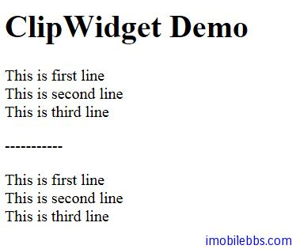

# Yii Framework 开发教程(12) UI 组件 ClipWidget 示例

CClipWidget 提供了类似录制“宏”的功能，定义在 CClipWidget 的 init 和 run 之间的内容可以存放在 Controller 的 Clip 变量中，然后重新回放到任意其它位置。

CClipWidget 封装的是 CBaseController 的 beginClip 和 endClip，CBaseController 的 beginClip 和 endClip 的基本用法如下：

首先定义 Clip

```

    $this->beginClip('clipID');
    // ... display the clip contents
    $this->endClip();
    
```

然后在需要使用这个 Clip 的地方

```

    echo $this->clips['clipID'];

```

如果$this 指向的不是 Controller，而是某个 Widget，可以使用

```

    echo $this->getController()->clips['clipID'];

```

使用 ClipWidget 的方法如下，

```

    <div class="form">
    <?php $form=$this->beginWidget('CClipWidget',
    array('id'=>'record')); ?>
    
        <?php echo 'This is first line'; ?>
    	<br />
    	<?php echo 'This is second line'; ?>
    	<br />
    	<?php echo 'This is third line'; ?>
    
    <?php $this->endWidget(); ?>
    
    <?php  echo $this->clips['record'];  ?>
    <p>-----------</p>
    <?php  echo $this->clips['record'];  ?>
    </div><!-- form -->

```

首先也是定义 Clip，这是通过 beginWidget 和 endWidget 来定义，clip 的 ID 由参数 id 传入。然后就可以调用 echo $this->clips[‘record’]; 在需要的地方显示这段录制的内容。beginWidget 和 endWidget 之间的内容可以根据需要自定义，本例显示三行文字。
显示结果如下：



本例[下载](http://www.imobilebbs.com/download/yii/ClipWidgetDemo.zip)

Tags: [PHP](http://www.imobilebbs.com/wordpress/archives/tag/php), [Yii](http://www.imobilebbs.com/wordpress/archives/tag/yii)
    