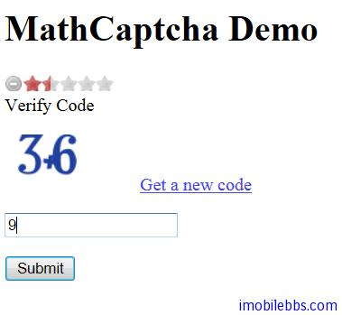

# Yii Framework 开发教程(21) UI 组件 自定义 Captcha 示例

Yii 内置的 Captcha 基本上可以满足大部分需求，如果你对验证码有特殊要求，你可以自定义 Captcha，这主要是通过扩展 CCaptchaAction 来实现的，本例自定义一个验证码功能，随机产生 10 以内的加减法，用户需要计算出正确的结果才能通过验证。

本例基于上例 [Yii Framework 开发教程(20) UI 组件 Captcha 示例](http://www.imobilebbs.com/wordpress/archives/4007)，做如下修改
首先在 protected/components  目录下创建一个 MathCaptchaAction，重载 generateVerifyCode, renderImage 等方法：
```


    class MathCaptchaAction extends CCaptchaAction
    {
    
    	protected function generateVerifyCode()
    	{
    		return mt_rand((int)$this->minLength,
    			(int)$this->maxLength);
    	}
    
    	public function renderImage($code)
    	{
    		parent::renderImage($this->getText($code));
    	}
    
    	protected function getText($code)
    	{
    		$code=(int)$code;
    		$rand=mt_rand(1,$code-1);
    		$op=mt_rand(0,1);
    		if($op)
    		{
    
    			return $code-$rand. '+' . $rand;
    
    		}else
    		{
    			return $code+$rand. '-' . $rand;
    		}
    	}
    }

```

然后修改 iteController 的 rules 使用新创建的 MathCaptchaAction

```

    public function actions()
    {
    	return array(
    		'captcha'=>array(
    				'class' => 'MathCaptchaAction',
    				'minLength' => 1,
    				'maxLength' => 10,
    		));
    }
    
```



本例[下载](http://www.imobilebbs.com/download/yii/CustomCaptchaDemo.zip)

Tags: [PHP](http://www.imobilebbs.com/wordpress/archives/tag/php), [Yii](http://www.imobilebbs.com/wordpress/archives/tag/yii)


