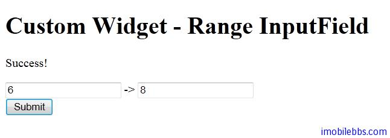

# Yii Framework 开发教程(10) UI 组件 自定义组件

在介绍 Yii 内置 UI 组件之前，先介绍一下如何自定义组件，这样也有助于理解 CWidget 的用法，
自定义组件就是重载 CWidget的init() 和 run() 方法。

```

    class MyWidget extends CWidget
    {
        public function init()
        {
            // 此方法会被 CController::beginWidget() 调用
        }
    
        public function run()
        {
            // 此方法会被 CController::endWidget() 调用
        }
    }

```

本例通过扩展 CInputWidget，定义一个值域输入 UI 组件-RangeInputField，也就是允许用户输入两个数字定义一个值域范围。CInputWidget 支持使用 CModel 或者直接使用变量，RangeInputField 也保留了这一传统。
RangeInputField 定义了三组属性。
$attributeFrom 和 $attributeTo 用于 CModel，配合 CHtml 的 activeXXX 方法，activeXXX 可以自动生成文本框的标签和文本框。
属性$nameFrom，$nameTo，$valueFrom，$valueTo 程序员可以自行定义文本框的标签。

按照 Yii 应用的缺省目录结构，新创建的 RangeInputField 放在 protected/components 目录下，因此创建 protected/components/RangeInputField.php

```

    class RangeInputField extends CInputWidget
    {
    	public $attributeFrom;
    	public $attributeTo;
    
    	public $nameFrom;
    	public $nameTo;
    
    	public $valueFrom;
    	public $valueTo;
    
    	function run()
    	{
    		if($this->hasModel())
    		{
    			echo CHtml::activeTextField($this->model,
    				$this->attributeFrom);
    			echo ' -> ';
    			echo CHtml::activeTextField($this->model,
    				$this->attributeTo);
    		}else
    		{
    			echo CHtml::textField($this->nameFrom,
    				$this->valueFrom);
    			echo ' -> ';
    			echo CHtml::textField($this->nameTo,
    				$this->valueTo);
    		}
    	}
    
    	/**
    	 * @return boolean whether this widget
    	 * is associated with a data model.
    	 */
    	protected function hasModel()
    	{
    		return $this->model instanceof CModel
    			&& $this->attributeFrom!==null
    			&& $this->attributeTo!==null;
    	}
    }
    
```

这样就自定义了一个新的 UI 组件 RangeInputField ，只重载了 run 方法， init 使用其父类中的方法。

下面就可以来测试这个新创建的自定义 UI 组件 RangeInputField， 我们使用 FormModel （使用 CModel)的方法来使用这个 UI 组件。

在 protected/models 下创建 RangeFrom.php

```

    class RangeForm extends CFormModel
    {
    	public $from;
    	public $to;
    
    	function rules()
    	{
    		return array(
    			array('from,to','numerical','integerOnly' =>true),
    			array('from','compare','compareAttribute'=>'to',
    					'operator'=> '<=','skipOnError' => true),
    		);
    	}
    }
    

```

然后修改缺省 Controller 的缺省方法， protected/controllers/siteController.php 中 actionIndex 方法。

```

    public function actionIndex()
    {
    	$success=false;
    	$model=new RangeForm();
    
    	if(!empty($_POST['RangeForm']))
    	{
    		$model->attributes=$_POST['RangeForm'];
    
    		if($model->validate()) $success=true;
    
    	}
    
    	$this->render('index', array(
    			'model' => $model,
    			'success' => $success,
    			));
    }
    

```

创建对应的 View

```

    <!--?php if($success) : ?-->
    
    Success!
    
    <!--?php endif ?--></pre>
    <div class="form"><!--?php $form=$this--->beginWidget('CActiveForm'); ?>
    
     <!--?php echo $form--->errorSummary($model); ?>
    <div class="row"><!--?php $this--->widget('RangeInputField',array(
     'model'=>$model,
     'attributeFrom' => 'from',
     'attributeTo' => 'to',
     )) ?></div>
    <div class="row submit"></div>
    <!--?php $this--->endWidget(); ?></div>
    <pre>
    <!-- form -->

```

运行这个例子



本例[下载](http://www.imobilebbs.com/download/yii/CustomWidgetDemo.zip)

Tags: [PHP](http://www.imobilebbs.com/wordpress/archives/tag/php), [Yii](http://www.imobilebbs.com/wordpress/archives/tag/yii)