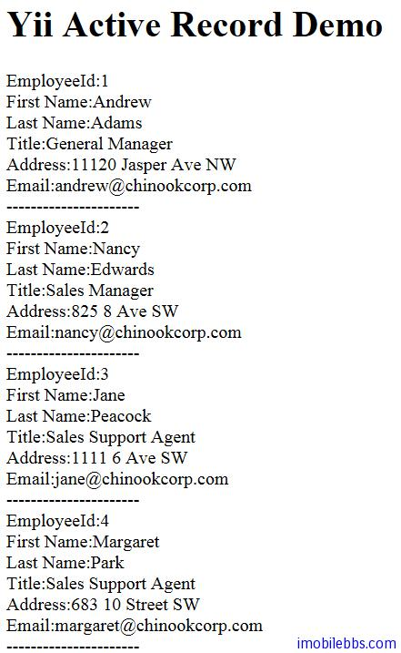

# Yii Framework 开发教程(26) 数据库-Active Record 示例

  Contents  
1 [创建记录](http://www.imobilebbs.com/wordpress/archives/4047#)  
2 [读取记录](http://www.imobilebbs.com/wordpress/archives/4047#)  
3 [更新记录](http://www.imobilebbs.com/wordpress/archives/4047#)  
4 [删除记录](http://www.imobilebbs.com/wordpress/archives/4047#)

使用 Java 或是.Net 写数据库应用，很多人都用过 ibernate（或 NHibernate）可以大大简化数据库编程，而以对象的方式来读写数据库（ORM），Yii 提供的 Active Record (AR) 也是一个流行的 对象-关系映射 (ORM) 技术。每个 AR 类代表一个数据表（或视图），数据表（或视图）的列在 AR 类中体现为类的属性，一个 AR 实例则表示表中的一行。 常见的 CRUD 操作作为 AR 的方法实现。因此，我们可以以一种更加面向对象的方式访问数据。

这里修改 [Yii Framework 开发教程(24) 数据库-DAO 示例](the-dao-database-examples.md) ，看看使用 Active Record 如何读取 Employee 表。

要访问一个数据表，我们首先需要通过集成 [CActiveRecord](http://www.yiiframework.com/doc/api/1.1/CActiveRecord) 定义一个 AR 类。 每个 AR 类代表一个单独的数据表，一个 AR 实例则代表那个表中的一行。

由于 AR 类经常在多处被引用，我们可以导入包含 AR 类的整个目录，而不是一个个导入。 例如，如果我们所有的 AR 类文件都在 protected/models 目录中，我们可以配置应用如下 

```

    'import'=>array(
    	'application.models.*',
    	), 
    
```

本例定义 Employee 类如下：

```

    class Employee extends CActiveRecord
    {
    	public static function model($className=__CLASS__)
    	{
    		return parent::model($className);
    	}
    
    	public function tableName()
    	{
    		return 'Employee';
    	}
    }

```

数据表行中列的值可以作为相应 AR 实例的属性访问。比如 $employee->EmployeeId 可以访问 Employee 的 EmployeeId 字段。

本例只是读取 Employee 表，修改 SiteController 的 indexAction 方法：

```

    public function actionIndex()
    {
    
    	$model = Employee::model()->findAll();
    
    	$this->render('index', array(
    		'model' => $model,
    
    		));
    }

```

可以看到只要一行代码 Employee::model()->findAll()就实现读取数据库表并赋值功能，来看看对应的显示记录的代码：

```

    <?php foreach($model as $employee)
    {
    
    	echo 'EmployeeId:' . $employee->EmployeeId . '<br />';
    	echo 'First Name:' . $employee->FirstName . '<br />';
    	echo 'Last Name:' . $employee->LastName . '<br />';
    	echo 'Title:' . $employee->Title . '<br />';
    	echo 'Address:' . $employee->Address . '<br />';
    	echo 'Email:' . $employee->Email . '<br />';
    	echo '---------------------- <br />';
    }
    
     ?>

```

可以看到使用 AR 可以通过数据库表的字段名（区分大小写）直接访问某个字段值，而无需在类 Employee 定义，从而大大简化代码。
在前面介绍 Model 时说过 CModel 有两个子类，一个是 FormModel，另外一个就是 CActiveRecord，CActiveRecord 定义了数据库访问的CRUD方法，比如

## 创建记录

要向数据表中插入新行，我们要创建一个相应 AR 类的实例，设置其与表的列相关的属性，然后调用 [save()](http://www.yiiframework.com/doc/api/1.1/CActiveRecord#save) 方法完成插入

```

    $employee=new Employee;
    $employee->FirstName='James';
    $employee->LastName='Shen';
    ...
    $employee->save()

```

如果表的主键是自增的，在插入完成后，AR 实例将包含一个更新的主键。如果一个列在表结构中使用了静态默认值（例如一个字符串，一个数字）定义。

## 读取记录

要读取数据表中的数据，我们可以通过如下方式调用 find 系列方法中的一种

```

    // 查找满足指定条件的结果中的第一行
    $post=Post::model()->find($condition,$params);
    // 查找具有指定主键值的那一行
    $post=Post::model()->findByPk($postID,$condition,$params);
    // 查找具有指定属性值的行
    $post=Post::model()->findByAttributes($attributes,$condition,$params);
    // 通过指定的 SQL 语句查找结果中的第一行
    $post=Post::model()->findBySql($sql,$params);

```

如上所示，我们通过 Post::model() 调用 find 方法。 请记住，静态方法 model() 是每个 AR 类所必须的。 此方法返回在对象上下文中的一个用于访问类级别方法（类似于静态类方法的东西）的 AR 实例。

如果 find 方法找到了一个满足查询条件的行，它将返回一个 Post 实例，实例的属性含有数据表行中相应列的值。 然后我们就可以像读取普通对象的属性那样读取载入的值，例如 echo $post->title;。

如果使用给定的查询条件在数据库中没有找到任何东西， find 方法将返回 null 。

调用 find 时，我们使用 $condition 和 $params 指定查询条件。此处 $condition 可以是 SQL 语句中的 WHERE 字符串，$params 则是一个参数数组，其中的值应绑定到 $condation 中的占位符。

## 更新记录

在 AR 实例填充了列的值之后，我们可以改变它们并把它们存回数据表。

```

    $post=Post::model()->findByPk(10);
    $post->title='new post title';
    $post->save(); // 将更改保存到数据库

```

## 删除记录

如果一个 AR 实例被一行数据填充,我们也可以删除此行数据

```

    $post=Post::model()->findByPk(10); // 假设有一个帖子，其 ID 为 10
    $post->delete(); // 从数据表中删除此行

```

注意，删除之后， AR 实例仍然不变，但数据表中相应的行已经没了

其它可以参见 [Yii 中文文档](http://www.yiiframework.com/doc/guide/1.1/zh_cn/database.ar)，这里不再详细复述了。

本例显示结果：



本例[下载](http://www.imobilebbs.com/download/yii/ActiveRecordDemo.zip)

Tags: [PHP](http://www.imobilebbs.com/wordpress/archives/tag/php), [Yii](http://www.imobilebbs.com/wordpress/archives/tag/yii)

