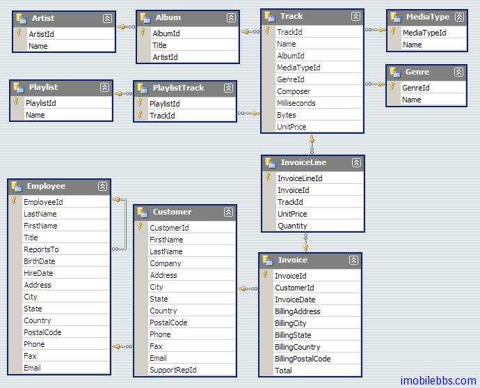

# Yii Framework 开发教程(23) 数据库-概述

Yii 提供了强大的数据库编程支持。

- Yii 数据访问对象(DAO)建立在 PHP 的数据对象(PDO)extension 上，使得在一个单一的统一的接口可以访问不同的数据库管理系统(DBMS)。使用 Yii 的 DAO 开发的应用程序可以很容易地切换使用不同的数据库管理系统，而不需要修改数据访问代码。
- Yii 的 Active Record（ AR ），实现了被广泛采用的对象关系映射(ORM)办法，进一步简化数据库编程。按照约定，一个类代表一个表，一个实例代表一行数据。Yii AR 消除了大部分用于处理 CRUD（创建，读取，更新和删除）数据操作的 sql 语句的重复任务。
- 尽管 Yii 的  DAO 和 AR 能够处理几乎所有数据库相关的任务，您仍然可以在 Yii application 中使用自己的数据库库。事实上，Yii 框架精心设计使得可以与其他第三方库同时使用。

Yii 框架支持的数据接口主要要下面三种：

- Active Record
- Query Builder
- DAO

本教程使用的示例数据库为

[Chinook Database](http://chinookdatabase.codeplex.com/) ，该示例库前生就是著名的 NorthWind 数据库，目前支持的数据类型有：
- [DB2](http://www-01.ibm.com/software/data/db2/express/)
- [EffiProz](http://effiproz.codeplex.com/)
- [MySQL](http://www.mysql.com/)
- [Oracle](http://www.oracle.com/technetwork/database/express-edition/overview/index.html)
- [PostgreSQL](http://www.postgresql.org/)
- [SQL Server](http://www.microsoft.com/sqlserver/)
- [SQL Server Compact](http://www.microsoft.com/sqlserver/2008/en/us/compact.aspx)
- [SQLite](http://www.sqlite.org/)

其数据模型为：

本教程主要是使用 MySQL，主要是因为和 PHP 配合使用的数据库类型用的最多的 MySQL，因此需要你安装 MySQL 数据库，Yii 框架支持多种数据库类型，支持这些数据库访问的接口基本类似，因此尽管本教程使用 MySQL 为例，所用到的知识同样适用于其它数据库类型。

Tags: [PHP](http://www.imobilebbs.com/wordpress/archives/tag/php), [Yii](http://www.imobilebbs.com/wordpress/archives/tag/yii)