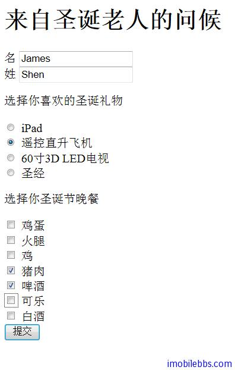

# Yii Framework 開發教程(48) 多國語言示例

本例通過 [Yii Framework 開發教程(11) UI 組件 ActiveForm 示例](http://www.imobilebbs.com/wordpress/archives/3955)添加中文支持簡要說明一下多國語言支持。詳細文檔可可以參考 [Yii 文檔](http://www.yiiframework.com/doc/guide/1.1/zh_cn/topics.i18n)。

信息翻譯是通過調用 [Yii::t()](http://www.yiiframework.com/doc/api/1.1/YiiBase#t) 實現的。此方法會將信息從 [源語言](http://www.yiiframework.com/doc/api/1.1/CApplication#sourceLanguage) 翻譯為 [目標語言](http://www.yiiframework.com/doc/api/1.1/CApplication#language)。

總體來說，要實現信息翻譯，需要執行如下幾步：

1. 在合適的位置調用 [Yii::t()](http://www.yiiframework.com/doc/api/1.1/YiiBase#t) ；
2. 以 protected/messages/LocaleID/CategoryName.php 的格式創建 PHP 翻譯文件。 每個文件簡單的返回一個信息翻譯數組。 注意，這是假設你使用默認的 [CPhpMessageSource](http://www.yiiframework.com/doc/api/1.1/CPhpMessageSource) 存儲翻譯信息。
3. 配置 [CApplication::sourceLanguage](http://www.yiiframework.com/doc/api/1.1/CApplication#sourceLanguage) 和 [CApplication::language](http://www.yiiframework.com/doc/api/1.1/CApplication#language)。

因此第一步為 pplication 添加合適的配置：

```

    <?php
    
    // This is the main Web application configuration. Any writable
    // CWebApplication properties can be configured here.
    return array(
    'basePath'=>dirname(__FILE__).DIRECTORY_SEPARATOR.'..',
    'sourceLanguage'=>'en',
    'language'=>'zh_cn',
    'name'=>'i18nDemo',
    
    ...
    // application components
    'components'=>array(
    'coreMessages'=>array(
    		'basePath'=>'protected/messages',
    		),),
    );

```

源語言為 en,目錄語言為中文(zh_cn) ，翻譯信息的目錄為 protected/messages.

然後再 protected/messages 創建 zh_cn 目錄，如果還需要支持其它語言，可以創建相應的目錄，然後在 zh_cn 創建一個 yii.php ，其中 yii 做為翻譯時的分類名（你可以選擇你自己喜歡的名字）。

檢查代碼中需要翻譯的地方，然後在 yii.php 文件中定義對應的翻譯：

```

    return array (
    
    	'Application Name' => '應用程序名稱',
    	'Greetings from Santa'=>'來自聖誕老人的問候',
    	'firstName'=>'名',
    	'lastName'=>'姓',
    	'Choose your Christmas Gift'=>'選擇你喜歡的聖誕禮物',
    	'iPad'=>'iPad',
    	'Remote control helicopter'=>'遙控直升飛機',
    	'60 inch 3D LED TV'=>'60寸3D LED電視',
    	'Holy Bible'=>'聖經',
    	'Choose your Christmas dinner'=>'選擇你聖誕節晚餐',
    	'Egg'=>'雞蛋',
    	'Ham'=>'火腿',
    	'Chicken'=>'雞',
    	'Pork'=>'豬肉',
    	'Beer'=>'啤酒',
    	'Coke'=>'可樂',
    	'Wine'=>'白酒',
    	'Submit'=>'提交',
    	'Merry Christmas'=>'聖誕快樂',
    	'On Christmas Day,You will be given'=>'聖誕節那天你將獲得',
    	'And you will have'=>'你可以有',
    	'for Christmas dinner'=>'作為聖誕晚餐',
    	'Start Again'=>'重新選擇'
    );
    1
    
    然後將原先使用英文字元串的地方換成yii::t('yii',xxx);比如DataModel.php
    1
    public function getGifts()
    {
    	return array(
    		'1'=>Yii::t('yii','iPad'),
    		'2'=>Yii::t('yii','Remote control helicopter'),
    		'3'=>Yii::t('yii','60 inch 3D LED TV'),
    		'4'=>Yii::t('yii','Holy Bible'),
    		);
    }
    
    public function getMeals()
    {
    	return array(
    		'1'=>Yii::t('yii','Egg'),
    		'2'=>Yii::t('yii','Ham'),
    		'3'=>Yii::t('yii','Chicken'),
    		'4'=>Yii::t('yii','Pork'),
    		'5'=>Yii::t('yii','Beer'),
    		'6'=>Yii::t('yii','Coke'),
    		'7'=>Yii::t('yii','Wine'),
    	);
    }

```



本例[下載](http://www.imobilebbs.com/download/yii/I18NDemo.zip)

Tags: [PHP](http://www.imobilebbs.com/wordpress/archives/tag/php), [Yii](http://www.imobilebbs.com/wordpress/archives/tag/yii)


 


 