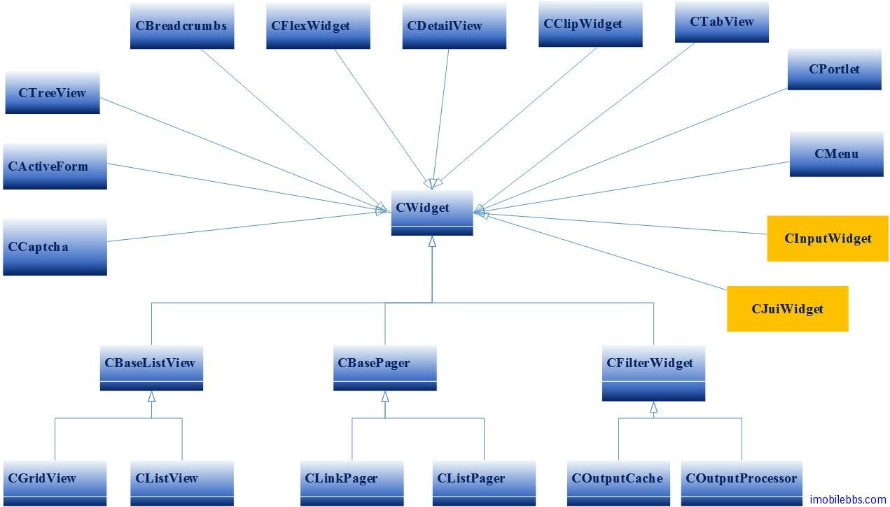
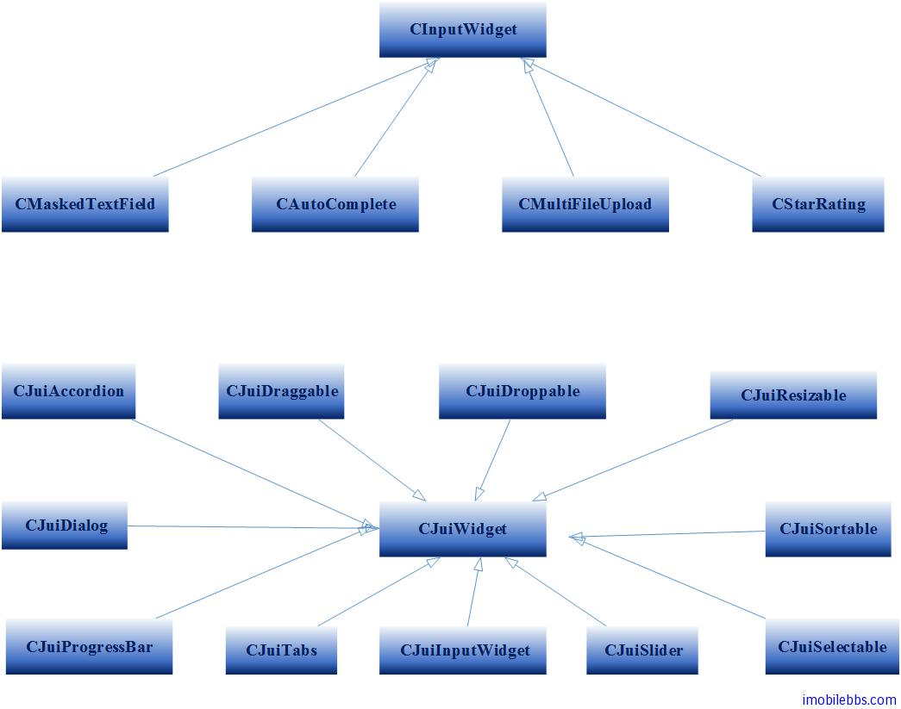

# Yii Framework 开发教程(9) UI 组件 Widget 概述

和通常的应用程序开发框架一样，Yii Framework 也提供了一组 UI 小组件（CWidget）来帮助程序员设计用户界面，小组是 CWidget 或其子类的实例.它是一个主要用于表现数据的组件.小组通常内嵌于一个视图来产生一些复杂而独立的用户界面.例如,一个日历小物件可用于渲染一个复杂的日历界面.小组件使用户界面更加可复用.

我们可以按如下视图脚本来使用一个小物件:

```

    <?php $this->beginWidget('path.to.WidgetClass'); ?>
    ...可能会由小物件获取的内容主体...
    <?php $this->endWidget();  >

```

或者

```

    <?php $this->widget('path.to.WidgetClass'); ? >;

```

后者用于不需要任何 body 内容的组件.

小组件可通过配置来定制它的表现.这是通过调用 [CBaseController::beginWidget](http://www.yiiframework.com/doc/api/1.1/CBaseController#beginWidget) 或 [CBaseController::widget](http://www.yiiframework.com/doc/api/1.1/CBaseController#widget) 设置其初始化属性值来完成的.例如,当使用 [CMaskedTextField](http://www.yiiframework.com/doc/api/1.1/CMaskedTextField) 小物件时,我们想指定被使用的 mask .我们通过传递一个携带这些属性初始化值的数组来实现.这里的数组的键是属性的名称,而数组的值则是小物件属性所对应的值.正如以下所示 :

```
    
    <?php
    $this->widget('CMaskedTextField',array(
         'mask'=&gt;'99/99/9999'
    ));
    ?>

```

继承 [CWidget](http://www.yiiframework.com/doc/api/1.1/CWidget) 并覆盖其 [init()](http://www.yiiframework.com/doc/api/1.1/CWidget#init) 和 [run()](http://www.yiiframework.com/doc/api/1.1/CWidget#run) 方法,可以定义一个新的小物件:

```

   class MyWidget extends CWidget
    {
        public function init()
        {
            // 此方法会被 CController::beginWidget() 调用
        }

        public function run()
        {
            // 此方法会被 CController::endWidget() 调用
        }
    }

```

小组件可以像一个控制器一样拥有它自己的视图.默认情况下,小物件的视图文件位于包含了小组件类文件目录的 views 子目录之下.这些视图可以通过调用 [CWidget::render()](http://www.yiiframework.com/doc/api/1.1/CWidget#render) 渲染,这一点和控制器很相似.唯一不同的是,小组件的视图没有布局文件支持。另外，小组件视图中的$this指向小物件实例而不是控制器实例。

在上一篇文章 [Yii Framework 开发简明教程(8)使用 FormModel](Use-FormModel.md) 说通过 CController 来处理用户提交事件，和 Windows 桌面应用或 ASP.Net 做个类比， Yii 中视图 View (HTML Form) 类似于 WinForm 或是 Asp.Net 的 Page。 控制类 Controller 类似 Windows 桌面应用或 Asp.Net 的事件处理（Code-Behind)类。 严格上来说，把 Yii 中视图 View (HTML Form)比作 Windows 桌面中的 WinFrom 或是 Asp.Net 的 Page 并不十分恰当，实际上 Yii 中视图的整个 HTML （或是 body）对等于 WinForm 或是 Page。 HTML Form 也只是 CWidget 的一个子类，对应到 [CActiveForm](http://www.yiiframework.com/doc/api/1.1/CActiveForm) UI 组件，此外，Yii 内置了下面 CWidget 类型：



其中 CJuiWidget (封装 JQuery）和 CInputWidget 进一步分为：



后面的教程将逐个介绍 Yii 提供的 UI 小组件的用法，除了这些内置的 UI 小组件外，Yii 也支持自定义 UI 小组件。

Tags: [PHP](http://www.imobilebbs.com/wordpress/archives/tag/php), [Yii](http://www.imobilebbs.com/wordpress/archives/tag/yii)