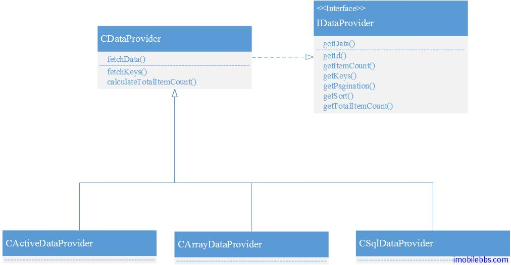

# Yii Framework 开发教程(28) Data Provider 简介

这开始介绍 Zii 组件之前，先简要介绍一下 Yii 支持的数据源接口 IDataProvider，IDataProvider 主要功能是为 UI 组件如 GridView，ListView 等提供数据源，同时也支持数据的分页和排序。下图为 Yii 内置的三种数据源：

- CActiveDataProvider  基于 Active Record 的数据源
- CArraryDataProvider 基于数组的数据源
- CSqlDataProvider      基于 SQL 查询的数据源



三种 Data Provider 的使用大同小异：

CActiveDataProvider 基于 ActiveRecord, 它通过 AR 的 [CActiveRecord::findAll](http://www.yiiframework.com/doc/api/1.1/CActiveRecord#findAll) 方法读取数据库记录，并通过 [criteria](http://www.yiiframework.com/doc/api/1.1/CActiveDataProvider#criteria) 属性设置查询条件。\

如：

```

    $dataProvider=new CActiveDataProvider('Post', array(
        'criteria'=>array(
            'condition'=>'status=1',
            'order'=>'create_time DESC',
            'with'=>array('author'),
        ),
        'pagination'=>array(
        'pageSize'=>20,
        ),
    ));
    // $dataProvider->getData() will return a list of Post objects

```

CArrayDataProvider 基于数组，其中属性 rawData 设置原始数据，一般为数组或者 DAO 查询结果，如：

```

    $rawData=Yii::app()->db->createCommand('SELECT * FROM tbl_user')->queryAll();
    // or using: $rawData=User::model()->findAll();
    $dataProvider=new CArrayDataProvider($rawData, array(
        'id'=>'user',
        'sort'=>array(
            'attributes'=>array(
                 'id', 'username', 'email',
            ),
        ),
        'pagination'=>array(
            'pageSize'=>10,
        ),
    ));
    // $dataProvider->getData() will return a list of arrays.

```

CSqlDataProvider 基于 SQL查询，通过设置 [sql](http://www.yiiframework.com/doc/api/1.1/CSqlDataProvider#sql) 语句来配置，比如：

```

    $count=Yii::app()->db->createCommand('SELECT COUNT(*) FROM tbl_user')->queryScalar();
    $sql='SELECT * FROM tbl_user';
    $dataProvider=new CSqlDataProvider($sql, array(
        'totalItemCount'=>$count,
        'sort'=>array(
            'attributes'=>array(
                  'id', 'username', 'email',
            ),
        ),
        'pagination'=>array(
        'pageSize'=>10,
        ),
    ));
    // $dataProvider->getData() will return a list of arrays.

```

关于 DataProvider 详细文档可以参见 [Yii 文档](http://www.yiiframework.com/doc/api/1.1/CDataProvider)

Tags: [PHP](http://www.imobilebbs.com/wordpress/archives/tag/php), [Yii](http://www.imobilebbs.com/wordpress/archives/tag/yii)


    