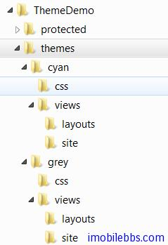
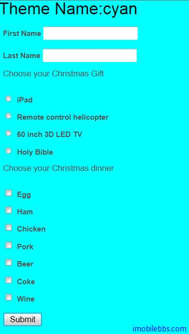
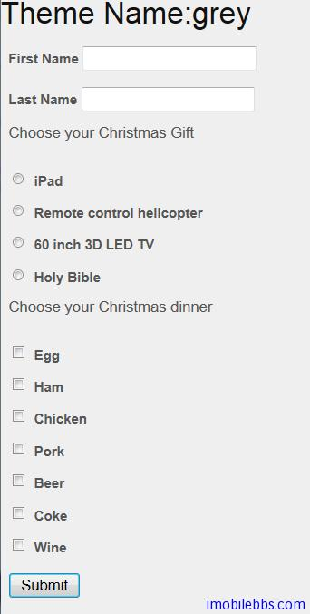
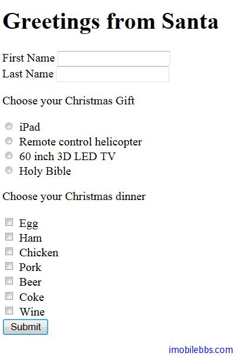

# Yii Framework 開發教程(47) 主題 Theme 示例

Theming 是一個在 Web 應用程序里定製網頁外觀的系統方式。通過採用一個新的主題，可以非常方便的改變應用的外觀。

在 Yii，每個主題由一個目錄代表，包含 view 文件，layout 文件和相關的資源文件，如圖片， CSS 文件， JavaScript 文件等。主題的名字就是他的目錄名字。全部主題都放在在同一目錄 WebRoot/themes 下 。在任何時候，只有一個主題可以被激活。


   提示：默認的主題根目錄 WebRoot/themes 可被配置成其他的。只需要配置 [themeManager](http://www.yiiframework.com/doc/api/1.1/CWebApplication#themeManager) 應用部件的屬性 [basePath](http://www.yiiframework.com/doc/api/1.1/CThemeManager#basePath) 和 [baseUrl](http://www.yiiframework.com/doc/api/1.1/CThemeManager#baseUrl)

要激活一個主題，設置 Web 應用程序的屬性 theme 為你所要的名字。可以在 application configuration 中配置或者在執行過程中在控制器的動作裡面修改。

   註：主題名稱是區分大小寫的。如果您嘗試啟動一個不存在的主題， yii: :app()->theme 將返回 null 。

主題目錄裡面內容的組織方式和 [application base path](http://www.yiiframework.com/doc/guide/1.1/zh_cn/basics.application#application-base-directory) 目錄下的組織方式一樣。例如，所有的 view 文件必須位於 views 下 ，布局 view 文件在 views/layouts 下 ，和系統 view 文件在 views/system 下。例如，如果我們要替換 PostController 的 create view 文件為 classic 主題下，我們將保存新的 view 文件為 WebRoot/themes/classic/views/post/create.php。

對於在 [module](http://www.yiiframework.com/doc/guide/1.1/zh_cn/basics.module) 裡面的控制器 view 文件，相應主題 view 文件將被放在 views 目錄下。例如，如果上述的 PostController 是在一個命名為 forum 的模塊里 ，我們應該保存 create view 文件為 WebRoot/themes/classic/views/forum/post/create.php 。如果 forum 模塊嵌套在另一個名為 support 模塊里 ，那麼 view 文件應為 WebRoot/themes/classic/views/support/forum/post/create.php 。

本例通過修改 [Yii Framework 開發教程(11) UI 組件 ActiveForm 示](http://www.imobilebbs.com/wordpress/archives/3955)，為它添加兩個主提，為簡單起見，兩個主題名字分別為 cyan,grey, 以其背景顏色命名。

首先在應用目錄結構下創建 themes 目錄，然後創建 cyan,grey 兩個子目錄，然後將預設的 protected/views 分別複製到兩個子目錄下，作為 Theme 的初始版本。


 
並使用 Yii 預設的 Css 定義，也分別拷貝到兩個主題子目錄下，作為 CSS 的初始文件。

下面分別對兩個主題下的 CSS 文件稍微做些修改，以示區別，修改 css/main.css 修改 body 的背景色

```

    body
    {
    	margin: 0;
    	padding: 0;
    	color: #555;
    	font: normal 10pt Arial,Helvetica,sans-serif;
    	background: #00FFFF;
    }
    
```

分別該為 Cyan 和 Grey 的顏色。

然後修改 layout/main.php 引用主題下的 CSS 文件，在一個主題的視圖，我們經常需要鏈接其他主題資源文件。例如，我們可能要顯示一個在主題下 images 目錄里的圖像文件。使用當前激活主題的 baseurl 屬性，我們就可以為此圖像文件生成如下 url

```


    yii: :app()->theme->baseUrl . '/images/FileName.gif'

```

修改後的布局文件如下：

```

    <!DOCTYPE html PUBLIC "-//W3C//DTD XHTML 1.0 Transitional//EN"
     "http://www.w3.org/TR/xhtml1/DTD/xhtml1-transitional.dtd">
    <html xmlns="http://www.w3.org/1999/xhtml" xml:lang="en" lang="en">
    <head>
    	<meta http-equiv="Content-Type" content="text/html; charset=utf-8" />
    	<meta name="language" content="en" />
    	<!-- blueprint CSS framework -->
    	<link rel="stylesheet" type="text/css"
    		href="<?php echo Yii::app()->theme->baseUrl; ?>/css/screen.css"
    		media="screen, projection" />
    	<link rel="stylesheet" type="text/css"
    		href="<?php echo Yii::app()->theme->baseUrl; ?>/css/print.css"
    		media="print" />
    	<!--[if lt IE 8]>
    	<link rel="stylesheet" type="text/css"
    		href="<?php echo Yii::app()->theme->baseUrl; ?>/css/ie.css"
    		media="screen, projection" />
    	<![endif]-->
    
    	<link rel="stylesheet" type="text/css"
    		href="<?php echo Yii::app()->theme->baseUrl; ?>/css/main.css" />
    	<link rel="stylesheet" type="text/css"
    		href="<?php echo Yii::app()->theme->baseUrl; ?>/css/form.css" />
    	<title><?php echo  Yii::app()->name . ' ' . Yii::app()->theme->name;?></title>
    </head>
    
    <body>
    
    <h1>Theme Name:<?php echo Yii::app()->theme->name;?></h1>
    
    <?php echo $content; ?>
    
    </body>
    </html>

```

定義好主題後，就可以通過配置 Application 的 theme 屬性來設置當前主題：

```

    return array(
        'theme'=>'cyan',
        ......
    );

```

兩個主題顯示如下：





如果指定的主題不存在，相當於沒有主題，將使用預設的顯示方式：



本例[下載](http://www.imobilebbs.com/download/yii/ThemeDemo.zip)

Tags: [PHP](http://www.imobilebbs.com/wordpress/archives/tag/php), [Yii](http://www.imobilebbs.com/wordpress/archives/tag/yii)


 


