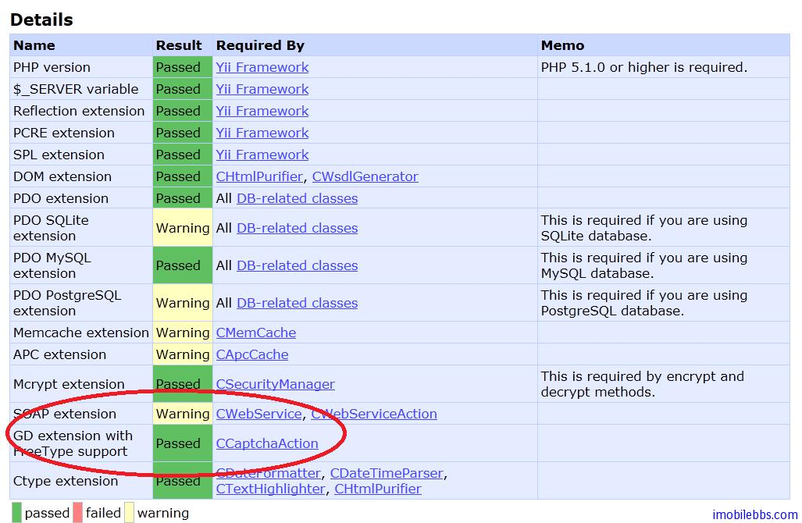
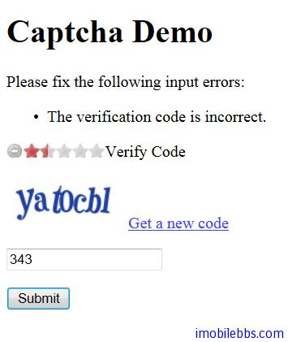

# Yii Framework 开发教程(20) UI 组件 Captcha 示例

Captcha（全自动区分计算机和人类的图灵测试-Completely Automated Public Turing test to tell Computers and Humans Apart，简称 [CAPTCHA](http://zh.wikipedia.org/wiki/%E9%AA%8C%E8%AF%81%E7%A0%81)）俗称验证码，是一种区分用户是[计算机](http://zh.wikipedia.org/wiki/%E8%AE%A1%E7%AE%97%E6%9C%BA)和[人](http://zh.wikipedia.org/wiki/%E4%BA%BA)的公共全自动程序。在 CAPTCHA 测试中，作为[服务器](http://zh.wikipedia.org/wiki/%E6%9C%8D%E5%8A%A1%E5%99%A8)的计算机会自动生成一个问题由用户来解答。这个问题可以由计算机生成并评判，但是必须只有人类才能解答。由于计算机无法解答 CAPTCHA 的问题，所以回答出问题的用户就可以被认为是人类。

Yii Framework 提供了类 CCaptcha 和 CCaptchaAction 用于支持验证码，要注意的是这个功能需要有 PHP　GD 扩展支持，可以通过 Yii 的 Requirements 应用来查询：



如果显示 Warning，可以通过安装 GD 扩展库，并修改 PHP.ini 打开该功能。

CCaptcha 也提供方法 CCaptcha::checkRequirements()　来检测 GD 库是否安装。

本例通过修改 [Yii Framework 开发教程(16) UI 组件 StarRating示例](ui-components-starrating-example.md)　为其添加 Captcha 功能，只有输入的验证码正确时，用户评分才有效，避免机器自动评分。

首先是修改 DataModel，添加一个属性 verifyCode 用来存放用户输入的验证码，并给其添加 [CCaptchaValidator](http://www.yiiframework.com/doc/api/1.1/CCaptchaValidator) 验证。

```

    class DataModel extends CFormModel
    {
    	public $rating;
    	public $verifyCode;
    
    	public function rules()
    	{
    
    		return array(
    			array('rating,verifyCode',  'safe'),
    			array('verifyCode','captcha',
    					'allowEmpty'=>!CCaptcha::checkRequirements()),
    		);
    
    	}
    }

```

然后修改 SiteController，添加 actions 方法，Captcha 组件缺省使用 CCaptchaAction，其缺省 ID 为 captcha。

```

    public function actions()
    {
    	return array(
    		'captcha'=>array(
    				'class' => 'CCaptchaAction',
    		));
    }
    
```

下面就可以在 View 中添加 Captcha 组件了：

```

    <div class="form">
    <?php $form=$this->beginWidget('CActiveForm'); ?>
    
    <?php echo $form->errorSummary($model); ?>
    
    <?php if(CCaptcha::checkRequirements()): ?>
    <?php $this->widget('CStarRating',array(
    	'model'=>$model,
    	'attribute'=>'rating',
    	'name'=>'rating',
    	'value'=>3,
    )); ?>
    
    <p />
       <?php  echo $form->label($model,'verifyCode') ?>
       <p />
       <?php $this->widget('CCaptcha'); ?>
       <p />
       <?php  echo $form->textField($model,'verifyCode') ?>
    
    <div class="row submit">
    <?php echo CHtml::submitButton('Submit'); ?>
    </div>
     <?php endif ?>
    <?php $this->endWidget(); ?>
    </div><!-- form -->
    
```



本例[下载](http://www.imobilebbs.com/download/yii/CCaptchaDemo.zip)

Tags: [PHP](http://www.imobilebbs.com/wordpress/archives/tag/php), [Yii](http://www.imobilebbs.com/wordpress/archives/tag/yii)


    