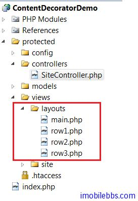
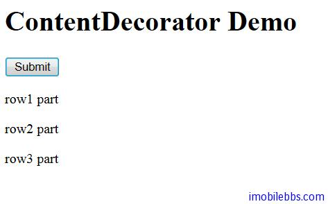

# Yii Framework 开发教程(13) UI 组件 ContentDecorator 示例

和 Java   Yii Framework 中的 Layout 也允许嵌套，这是通过 CContentDecorator 来实现的，不过代码中并不需要直接使用 CContentDecorator ，而是在定义 layout 使用

```

    $this->beginContent('path/to/view');
    // ... content to be decorated
    $this->endContent();

```

其中 view 为另外一个布局。

本例定义四个 Layout，一个嵌套一个：



```

    ///main.php
    
    <!DOCTYPE html PUBLIC "-//W3C//DTD XHTML 1.0 Transitional//EN"
    "http://www.w3.org/TR/xhtml1/DTD/xhtml1-transitional.dtd">
    <html xmlns="http://www.w3.org/1999/xhtml">
    <head>
    <meta http-equiv="Content-Type" content="text/html; charset=utf-8" />
    <title><?php echo  Yii::app()->name;?></title>
    </head>
    
    <body>
    <h1>Widget Demo</h1>
    
    <?php echo $content; ?>
    
    </body>
    </html>
    
    ///row1.php
    <?php $this->beginContent('/layouts/row2'); ?>
    <div>
    		<?php echo $content; ?>
    </div>
    <p />
    <div>
    		<?php echo 'row1 part'; ?>
    </div>
    <?php $this->endContent(); ?>
    
    //row2.php
    <?php $this->beginContent('/layouts/row3'); ?>
    <div>
    		<?php echo $content; ?>
    </div>
    <p />
    <div>
    		<?php echo 'row2 part'; ?>
    </div>
    <?php $this->endContent(); ?>
    
    ///row3.php
    <?php $this->beginContent('/layouts/main'); ?>
    <div>
    		<?php echo $content; ?>
    </div>
    <p />
    <div>
    		<?php echo 'row3 part'; ?>
    </div>
    <?php $this->endContent(); ?>

```

显示结果如下：



本例[下载](http://www.imobilebbs.com/download/yii/ContentDecoratorDemo.zip)

Tags: [PHP](http://www.imobilebbs.com/wordpress/archives/tag/php), [Yii](http://www.imobilebbs.com/wordpress/archives/tag/yii)
    