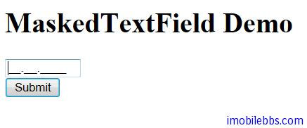

# Yii Framework 开发教程(14) UI 组件 MaskedTextField 示例

CMaskedTextField 为格式输入框，可以为文本框指定 Mask 限制用户可以出入的文本格式，如本例使用 99.99.9999 ，可以只允许输入类似日期的文本。

修改 View，添加 CMaskedTextField 组件

```

    <?php $this->widget('CMaskedTextField',array(
    	'model'=>$model,
    	'attribute'=>'date',
    	'name'=>'date',
    	'mask'=>'99.99.9999',
    	'htmlOptions'=>array(
    				'style'=>'width:80px;'
    				),
    			));
    ?>

```

为了配合 CMaskedTextField 使用，我们修改 DataModel，添加一个属性 date

```

    class DataModel extends CFormModel
    {
    	public $date;
    
    	public function rules()
        {
    
            return array(
    			    array('date',  'safe'),
            );
    
        }
    
    }

```



本例[下载](http://www.imobilebbs.com/download/yii/MaskedTextFieldDemo.zip)

Tags: [PHP](http://www.imobilebbs.com/wordpress/archives/tag/php), [Yii](http://www.imobilebbs.com/wordpress/archives/tag/yii)
    