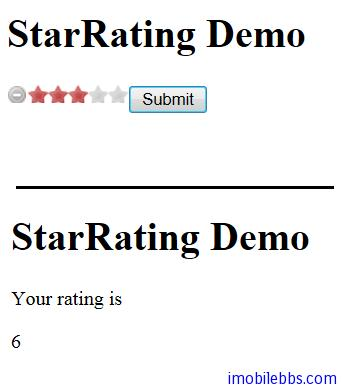

# Yii Framework 开发教程(16) UI 组件 StarRating 示例

CStarRating 主要用于评分，显示一组星星（5 个）用于打分。

基本用法如下

```

    <div class="form">
    <?php $form=$this->beginWidget('CActiveForm'); ?>
    
       <?php $this->widget('CStarRating',array(
    	    'model'=>$model,
    	    'attribute'=>'rating',
    	    'name'=>'rating',
    	    'value'=>3,
        )); ?>
    
        <div class="row submit">
        <?php echo CHtml::submitButton('Submit'); ?>
        </div>
    
    <?php $this->endWidget(); ?>
    </div><!-- form -->

```

在 Controller 中可以通过$_POST[‘rating’] 来访问 Star 的值，比如：

```

    public function actionIndex()
    {
    
    	$model=new DataModel();
    	$model->rating=3;
    	if(!empty($_POST['rating']))
    	{
    		$model->rating=$_POST['rating'];
    
    		if($model->validate()) {
    			$this->render('response', array(
    				'model' => $model,
    
    				));
    			 return;
    		}
    
    	}
    
    	$this->render('index', array(
    			'model' => $model,
    
    			));
    }
    
```

CStarRating 也可以设为只读，此时 StarRating 用来显示评分而用户无法修改评分。这是通过’readOnly’=>true,来实现的。



本例[下载](http://www.imobilebbs.com/download/yii/MaskedTextFieldDemo.zip)

Tags: [PHP](http://www.imobilebbs.com/wordpress/archives/tag/php), [Yii](http://www.imobilebbs.com/wordpress/archives/tag/yii)
        