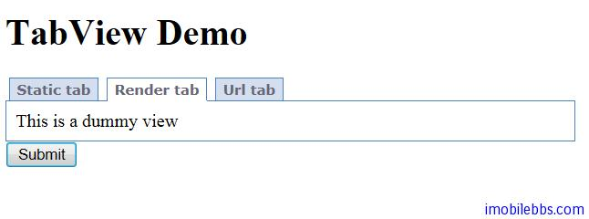

# Yii Framework 开发教程(17) UI 组件 TabView 示例

CTabView 用来显示分页标签，使用 TabView 的基本方法是配置 tabs 属性，每个 Tab 可以配置如下属性
   
  - title:标签标题.
  - content: 标签显示内容.
  - view: 标签显示View的名称，如果同时制定 Content，则显示 Content 内容。
  - url: 点击该标签时页面重定向到指定 URL.
  - data: 当指定 View 属性时传给该 View 的属性数组.

本例显示三个标签页，分别使用不同的标签内容：

```

    <div class="form">
    <?php $form=$this->beginWidget('CActiveForm'); ?>
    
    <?php $this->widget('CTabView',array(
    	'activeTab'=>'tab2',
    	'tabs'=>array(
    				'tab1'=>array(
    					'title'=>'Static tab',
    					'content'=>'Content for tab 1'
    					),
    				'tab2'=>array(
    					'title'=>'Render tab',
    					'view'=>'view'
    					),
    				'tab3'=>array(
    					'title'=>'Url tab',
    					'url'=>Yii::app()->createUrl("site/url"),
    					)
    				),
    			'htmlOptions'=>array(
    				'style'=>'width:500px;'
    				)
    )); ?>
    
    <div class="row submit">
    <?php echo CHtml::submitButton('Submit'); ?>
    </div>
    
    <?php $this->endWidget(); ?>
    </div><!-- form -->

```

TabView 缺省情况下第一个页面为当前页面，可以通过 activeTab 来修改当前页面，如本例将第二也设为当前页。



本例[下载](http://www.imobilebbs.com/download/yii/TabViewDemo.zip)

Tags: [PHP](http://www.imobilebbs.com/wordpress/archives/tag/php), [Yii](http://www.imobilebbs.com/wordpress/archives/tag/yii)
        