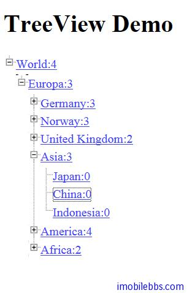

# Yii Framework 开发教程(19) UI 组件 TreeView 示例

CTreeView 用来显示具有层次结构的数据，使用 TreeView 通过设置 Data 属性。Data 为具有下面结构的数组：

- ext: string, 树节点的文本.
- expanded: boolean,可选，表示该节点是否展开.
- id: string, 可选，该节点ID.
- hasChildren: boolean, 可选，缺省为 False,当为 True 表示该节点含有子节点.
- children: array,可选，子节点数组。.
- htmlOptions: array, HTML 选项。

到目前为止我们还没有介绍读取数据库，因此本例使用 Hard Code 的数据如下：

```

    array(
      'text' =>  '<a id="27" href="#">World:4</a>' ,
      'id' =>  '27' ,
      'hasChildren' =>  true,
      'children' =>
    	array
    	  (
    		array(
    		  'text' =>  '<a id="1" href="#">Europa:3</a>' ,
    		  'id' =>  '1' ,
    		  'hasChildren' =>  true,
    		  'children' =>
    			array
    		(
    			array(
    				'text' =>  '<a id="3" href="#">Germany:3</a>' ,
    				'id' =>  '3' ,
    				'hasChildren' =>  true,
    				'children' =>
    				array
    				(
    					array(
    						'text' =>  '<a id="15" href="#">Munich:0</a>' ,
    						'id' =>  '15' ,
    						'hasChildren' =>  false,
    						),
    					array(
    						'text' =>  '<a id="16" href="#">Stuttgart:0</a>' ,
    						'id' =>  '16' ,
    						'hasChildren' =>  false,
    						),
    					array(
    						'text' =>  '<a id="5" href="#">Berlin:0</a>' ,
    						'id' =>  '5' ,
    						'hasChildren' =>  false,
    						)
    					)),
    			array(
    				'text' =>  '<a id="2" href="#">Norway:3</a>' ,
    				'id' =>  '2' ,
    				'hasChildren' =>  true,
    				'children' =>
    				array
    				(
    					array(
    						'text' =>  '<a id="10" href="#">Stavanger:0</a>' ,
    						'id' =>  '10' ,
    						'hasChildren' =>  false,
    						),
    					array(
    						'text' =>  '<a id="12" href="#">Oslo:0</a>' ,
    						'id' =>  '12' ,
    						'hasChildren' =>  false,
    						),
    					array(
    						'text' =>  '<a id="11" href="#">Bergen:0</a>' ,
    						'id' =>  '11' ,
    						'hasChildren' =>  false,
    						))),
    			array(
    				'text' =>  '<a id="4" href="#">United Kingdom:2</a>' ,
    				'id' =>  '4' ,
    				'hasChildren' =>  true,
    				'children' =>
    				array(
    
    					array(
    						'text' =>  '<a id="13" href="#">London:0</a>' ,
    						'id' =>  '13' ,
    						'hasChildren' =>  false,
    						),
    					array(
    						'text' =>  '<a id="14" href="#">Manchester:0</a>' ,
    						'id' =>  '14' ,
    						'hasChildren' =>  false,
    						))),
    			array(
    				'text' =>  '<a id="7" href="#">Asia:3</a>' ,
    				'id' =>  '7' ,
    				'hasChildren' =>  true,
    				'children' =>
    				array
    				(
    					array(
    						'text' =>  '<a id="18" href="#">Japan:0</a>' ,
    						'id' =>  '18' ,
    						'hasChildren' =>  false,
    						),
    					array(
    						'text' =>  '<a id="20" href="#">China:0</a>' ,
    						'id' =>  '20' ,
    						'hasChildren' =>  false,
    						),
    					array(
    						'text' =>  '<a id="19" href="#">Indonesia:0</a>' ,
    						'id' =>  '19' ,
    						'hasChildren' =>  false,
    						)
    					)),
    			array(
    				'text' =>  '<a id="9" href="#">America:4</a>' ,
    				'id' =>  '9' ,
    				'hasChildren' =>  true,
    				'children' =>
    				array
    				(
    					array(
    						'text' =>  '<a id="23" href="#">Canada:0</a>' ,
    						'id' =>  '23' ,
    						'hasChildren' =>  false,
    						),
    					array(
    						'text' =>  '<a id="24" href="#">United States:0</a>' ,
    						'id' =>  '24' ,
    						'hasChildren' =>  false,
    						),
    					array(
    						'text' =>  '<a id="25" href="#">Mexico:0</a>' ,
    						'id' =>  '25' ,
    						'hasChildren' =>  false,
    						),
    					array(
    						'text' =>  '<a id="26" href="#">Argentina:0</a>',
    						'id' =>  '26' ,
    						'hasChildren' =>  false,
    						))),
    			array(
    				'text' =>  '<a id="8" href="#">Africa:2</a>' ,
    				'id' =>  '8' ,
    				'hasChildren' =>  true,
    				'children' =>
    				array(
    
    					array(
    						'text' =>  '<a id="22" href="#">Kenya:0</a>' ,
    						'id' =>  '22' ,
    						'hasChildren' =>  false,
    						),
    					array(
    						'text' =>  '<a id="21" href="#">Tanzania:0</a>' ,
    						'id' =>  '21' ,
    						'hasChildren' =>  false
    						)
    					)
    				)
    			)))));

```

这里为每个节点的文本都添加了一个链接 同时也演示了使用 JQuery 响应节点的点击事件，这是通过客户端 JavaScripts 来实现的。

修改 View 定义

```

    <?php
    $cs=Yii::app()->clientScript;
    $cs->registerScript('menuTreeClick', "
    	jQuery('#menu-treeview a').click(function() {
    		alert('Node #'+this.id+' was clicked!');
    		return false;
    	});
    ");
    
    $this->widget('CTreeView',array(
    	'id'=>'menu-treeview',
    	'data'=>DataModel::getDummyData(),
    
    	'control'=>'#treecontrol',
    	'animated'=>'fast',
    	'collapsed'=>true,
    	'htmlOptions'=>array(
    				'class'=>'filetree'
    				)
    			));
    ?>

```

clientScript 的 [registerScript](http://www.yiiframework.com/doc/api/1.1/CClientScript/#registerScript-detail) 用来做客户端定义 JavaScripts。



本例[下载](http://www.imobilebbs.com/download/yii/TreeViewDemo.zip)

Tags: [PHP](http://www.imobilebbs.com/wordpress/archives/tag/php), [Yii](http://www.imobilebbs.com/wordpress/archives/tag/yii)


