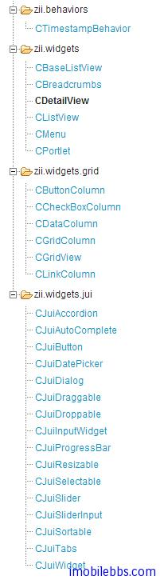
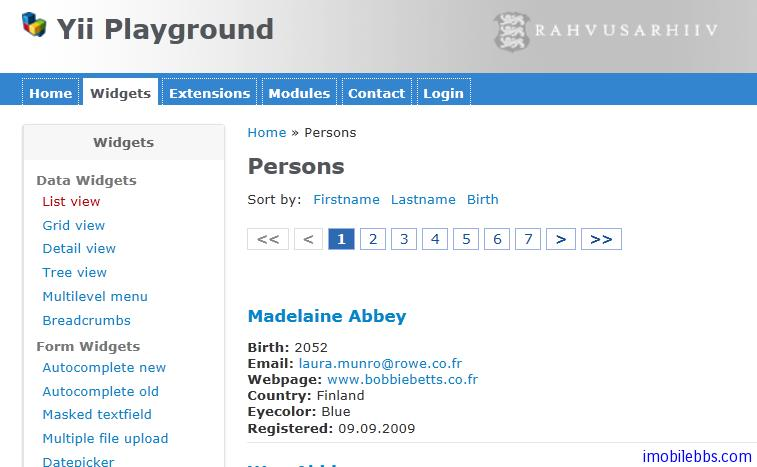
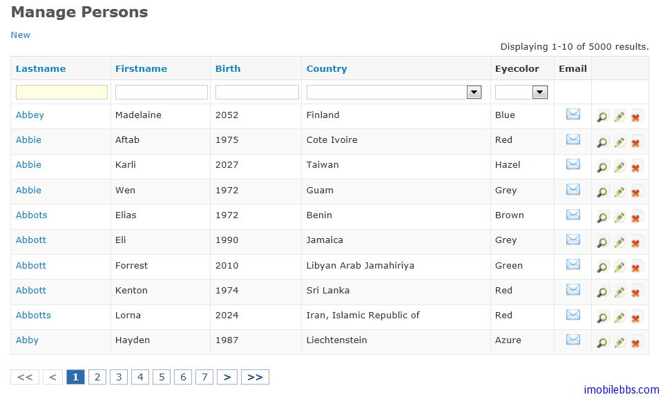
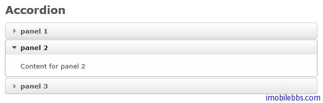
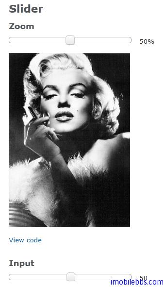
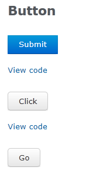
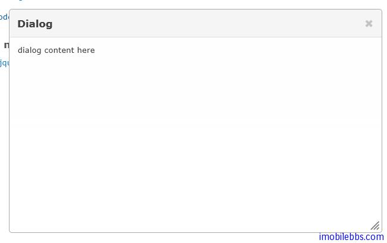
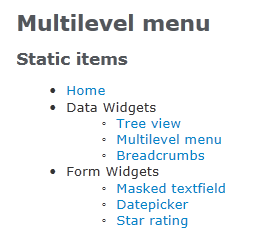

# Yii Framework 开发教程(22) UI 组件 Zii 组件简介

前面介绍了 Yii 框架支持的部分 UI 组件，除了前面介绍的 UI 组件外，Yi i框架还提供了 Zii 组件库，包括列表视图 ListView，表格视图 GridView，此外还包括一些基于 JQuery 的 UI 组件，如 AutoComplete,DataPicker, Button, Drag 和 Drop 等，Zii 组件主要定义在包 zii.* ,zii.widget.*

由于其中部分 UI 组件和数据源（Data Provider）关系密切，因此需要先介绍 Yii 支持的数据库接口，下篇文章开始介绍 Yii 框架的数据库访问接口，然后再逐一介绍 Zii 组件。下面列出 Zii 支持的部分 UI 组件的截图（选自 [YiiPlayground](https://github.com/giovdk21/yiiplayground) ）

Tags: [PHP](http://www.imobilebbs.com/wordpress/archives/tag/php), [Yii](http://www.imobilebbs.com/wordpress/archives/tag/yii)

