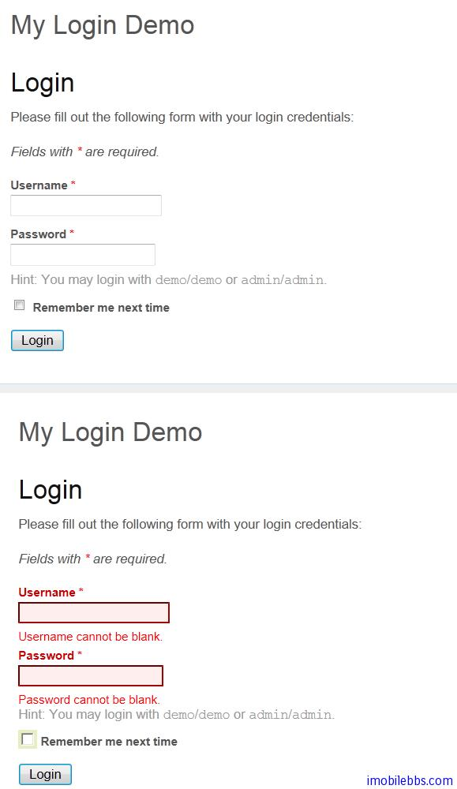

# Yii Framework 开发教程(8) 使用 FormModel

  Contents

1. [定义模型类](http://www.imobilebbs.com/wordpress/archives/3911#1)
2. [声明验证规则](http://www.imobilebbs.com/wordpress/archives/3911#2)
3. [安全的特性赋值](http://www.imobilebbs.com/wordpress/archives/3911#3)  
  [3.1  1.1 中的安全特性](http://www.imobilebbs.com/wordpress/archives/3911#11)   
  [3.2  1.0 中的安全特性](http://www.imobilebbs.com/wordpress/archives/3911#10)
4. [触发验证](http://www.imobilebbs.com/wordpress/archives/3911#4)
5. [提取验证错误](http://www.imobilebbs.com/wordpress/archives/3911#50)
6. [特性标签](http://www.imobilebbs.com/wordpress/archives/3911#6)
7. [创建动作Action方法](http://www.imobilebbs.com/wordpress/archives/3911#7-Action)
8. [构建视图](http://www.imobilebbs.com/wordpress/archives/3911#8)

通过前面的学习，我们了解了 Yii Web 应用的基本组成部分，也会编写像 Hangman 猜单词游戏这样简单的应用。在第一个例子 [Yii Framework 开发简明教程(1) 第一个应用Hello World](first-application-hello-world.md) 我们介绍了 Yii Web 应用采用 MVC 模型，也说明了本教程目的是通过不同的视角（主要是通过开发 Windows 应用 C++，C#程序员的角度）帮助 Windows 桌面应用或 ASP.Net 程序员较快的掌握 PHP Yii Framework 应用程序框架。

前面我们介绍了通过 CHtml 创建 View（页面视图 Form），通过 CController 来处理用户提交事件，和 Windows  桌面应用或 ASP.Net 做个类比， Yii 中视图 View (HTML Form) 类似于 WinForm 或是 Asp.Net 的 Page。 控制类 Controller 类似 Windows 桌面应用或 Asp.Net 的事件处理（Code-Behind)类。不同的是 Asp.Net 和 Windows 桌面应用可以为 UI 中各个 UI 组件，比如文本框，按钮定义 Id，然后为不同的 UI 组件添加事件处理。PHP 应用或是 Yii 应用没有对应的机制可以为定义在 HTML Form 中的 UI 组件定义一个 Id，并为 UI 组件定义事件处理。 然而 Yii 框架提供了  CFormModel 可以支持类似的功能，简单的说，通过 CFormModel，可以为 HTML Form 中的 UI 小组件定义变量，并且可以在其控制类 Controller 中访问这些变量。每个 Yii View（Form)一般都提供一个“提交”按钮（Submit Button），用户点击这个“提交按钮”触发 CController对象对应的 actionXXX 方法，在 actionXXX 方法中可以通过 CFormModel 来访问 HTML Form 的 UI 组件的值。

前面教程中说过 Yii 中的模型（Model）是 [CModel](http://www.yiiframework.com/doc/api/1.1/CModel) 或其子类的实例。模型用于保持数据以及与其相关的业务逻辑，

Yii 实现了两种类型的模型：表单模型和 Active Record。二者均继承于相同的基类 [CModel](http://www.yiiframework.com/doc/api/1.1/CModel)。

表单模型是 [CFormModel](http://www.yiiframework.com/doc/api/1.1/CFormModel) 的实例。表单模型用于保持从用户的输入获取的数据。 这些数据经常被获取，使用，然后丢弃。例如，在一个登录页面中， 我们可以使用表单模型用于表示由最终用户提供的用户名和密码信息。更多详情，请参考 [使用表单](http://www.yiiframework.com/doc/guide/1.1/zh_cn/form.model)。本篇介绍 CFormModel 的用法，

Active Record (AR) 是一种用于通过面向对象的风格抽象化数据库访问的设计模式。 每个 AR 对象是一个 [CActiveRecord](http://www.yiiframework.com/doc/api/1.1/CActiveRecord) 或其子类的实例。代表数据表中的一行。 行中的字段对应 AR 对象中的属性。更多关于 AR 的细节请阅读 [Active Record](http://www.yiiframework.com/doc/guide/1.1/zh_cn/database.ar). 后面介绍数据库使用时再介绍。

本篇使用一个简单的登录界面来介绍 FormModel 的用法,本例[下载](http://www.imobilebbs.com/download/yii/LoginDemo.zip)。

## 1. 定义模型类

下面我们创建了一个 LoginForm (protected/models/LoginForm.php) 模型类用于在一个登录页中收集用户的输入。 由于登录信息只被用于验证用户，并不需要保存，因此我们将 LoginForm 创建为一个表单模型。

```

    class LoginForm extends CFormModel
    {
       public $username;
       public $password;
       public $rememberMe=false;
    }

```

LoginForm 中定义了三个属性: $username, $password 和 $rememberMe。他们用于保存用户输入的用户名和密码，还有用户是否想记住他的登录的选项。 由于 $rememberMe 有一个默认的值 false，相应的选项在初始化显示在登录表单中时将是未勾选状态。

    信息: 我们将这些成员变量称为 特性（attributes） 而不是 属性（properties），以区别于普通的
    属性（properties）。 特性（attribute）是一个主要用于存储来自用户输入或数据库数据的属性
    （propertiy）。
## 2. 声明验证规则

一旦用户提交了他的输入，模型被填充，我们就需要在使用前确保用户的输入是有效的。 这是通过将用户的输入和一系列规则执行验证实现的。我们在 rules() 方法中指定这些验证规则， 此方法应返回一个规则配置数组。

```
   
    class LoginForm extends CFormModel
    {
        public $username;
        public $password;
        public $rememberMe=false;
    
        private $_identity;
    

        public function rules()
    {
        return array(
          array('username, password', 'required'),
          array('rememberMe', 'boolean'),
          array('password', 'authenticate'),
        );
    }
    
    public function authenticate($attribute,$params)
    {
    $this->_identity=new UserIdentity($this->username,
      $this->password);
    if(!$this->_identity->authenticate())
    $this->addError('password','错误的用户名或密码。');
    }
    }


```

上述代码指定：username 和 password 为必填项， password 应被验证（authenticated），rememberMe 应该是一个布尔值。

rules() 返回的每个规则必须是以下格式：

```

    array('AttributeList', 'Validator', 'on'=>'ScenarioList', ...附加选项)

```

其中 AttributeList（特性列表） 是需要通过此规则验证的特性列表字符串，每个特性名字由逗号分隔;Validator（验证器） 指定要执行验证的种类；on 参数是可选的，它指定此规则应被应用到的场景列表； 附加选项是一个名值对数组，用于初始化相应验证器的属性值。

有三种方式可在验证规则中指定 Validator 。第一， Validator 可以是模型类中一个方法的名字，就像上面示例中的 authenticate 。验证方法必须是下面的结构：

```

    /**
     * @param string 所要验证的特性的名字
     * @param array 验证规则中指定的选项
     */
    public function ValidatorName($attribute,$params) { ... }

```

第二，Validator 可以是一个验证器类的名字，当此规则被应用时， 一个验证器类的实例将被创建以执行实际验证。规则中的附加选项用于初始化实例的属性值。 验证器类必须继承自 [CValidator](http://www.yiiframework.com/doc/api/1.1/CValidator)。

第三，Validator 可以是一个预定义的验证器类的别名。在上面的例子中， required 名字是 [CRequiredValidator](http://www.yiiframework.com/doc/api/1.1/CRequiredValidator) 的别名，它用于确保所验证的特性值不为空。 下面是预定义的验证器别名的完整列表：

- boolean: [CBooleanValidator](http://www.yiiframework.com/doc/api/1.1/CBooleanValidator) 的别名， 确保特性有一个 [CBooleanValidator::trueValue](http://www.yiiframework.com/doc/api/1.1/CBooleanValidator#trueValue) 或 [CBooleanValidator::falseValue](http://www.yiiframework.com/doc/api/1.1/CBooleanValidator#falseValue) 值。
- captcha: [CCaptchaValidator](http://www.yiiframework.com/doc/api/1.1/CCaptchaValidator) 的别名，确保特性值等于 [CAPTCHA](http://en.wikipedia.org/wiki/Captcha) 中显示的验证码。
- compare: [CCompareValidator](http://www.yiiframework.com/doc/api/1.1/CCompareValidator) 的别名，确保特性等于另一个特性或常量。
- email: [CEmailValidator](http://www.yiiframework.com/doc/api/1.1/CEmailValidator) 的别名，确保特性是一个有效的 Email 地址。
- default: [CDefaultValueValidator](http://www.yiiframework.com/doc/api/1.1/CDefaultValueValidator) 的别名，指定特性的默认值。
- exist: [CExistValidator](http://www.yiiframework.com/doc/api/1.1/CExistValidator) 的别名，确保特性值可以在指定表的列中可以找到。
- file: [CFileValidator](http://www.yiiframework.com/doc/api/1.1/CFileValidator) 的别名，确保特性含有一个上传文件的名字。
- filter: [CFilterValidator](http://www.yiiframework.com/doc/api/1.1/CFilterValidator) 的别名，通过一个过滤器改变此特性。
- in: [CRangeValidator](http://www.yiiframework.com/doc/api/1.1/CRangeValidator) 的别名，确保数据在一个预先指定的值的范围之内。
- length: [CStringValidator](http://www.yiiframework.com/doc/api/1.1/CStringValidator) 的别名，确保数据的长度在一个指定的范围之内。
- match: [CRegularExpressionValidator](http://www.yiiframework.com/doc/api/1.1/CRegularExpressionValidator) 的别名，确保数据可以匹配一个正则表达式。
- numerical: [CNumberValidator](http://www.yiiframework.com/doc/api/1.1/CNumberValidator) 的别名，确保数据是一个有效的数字。
- required: [CRequiredValidator](http://www.yiiframework.com/doc/api/1.1/CRequiredValidator) 的别名，确保特性不为空。
- type: [CTypeValidator](http://www.yiiframework.com/doc/api/1.1/CTypeValidator) 的别名，确保特性是指定的数据类型。
- unique: [CUniqueValidator](http://www.yiiframework.com/doc/api/1.1/CUniqueValidator) 的别名，确保数据在数据表的列中是唯一的。
- url: [CUrlValidator](http://www.yiiframework.com/doc/api/1.1/CUrlValidator) 的别名，确保数据是一个有效的 URL。

下面我们列出了几个只用这些预定义验证器的示例：

```

    // 用户名为必填项
    array('username', 'required'),
    // 用户名必须在 3 到 12 个字符之间
    array('username', 'length', 'min'=>3, 'max'=>12),
    // 在注册场景中，密码password必须和password2一致。
    array('password', 'compare', 'compareAttribute'=>'password2', 'on'=>'register'),
    // 在登录场景中，密码必须接受验证。
    array('password', 'authenticate', 'on'=>'login'),

```

## 3. 安全的特性赋值

在一个类的实例被创建后，我们通常需要用最终用户提交的数据填充它的特性。 这可以通过如下块赋值（massive assignment）方式轻松实现：

```

    $model=new LoginForm;
    if(isset($_POST['LoginForm']))
         $model->attributes=$_POST['LoginForm'];

```

最后的表达式被称作 块赋值（massive assignment） ，它将 $_POST['LoginForm'] 中的每一项复制到相应的模型特性中。这相当于如下赋值方法：

```

    foreach($_POST['LoginForm'] as $name=>$value)
    {
        if($name 是一个安全的特性)
            $model->$name=$value;
    }

```

检测特性的安全非常重要，例如，如果我们以为一个表的主键是安全的而暴露了它，那么攻击者可能就获得了一个修改记录的主键的机会， 从而篡改未授权给他的内容。

检测特性安全的策略在版本 1.0 和 1.1 中是不同的，下面我们将分别讲解：

### 1.1 中的安全特性

在版本 1.1 中，特性如果出现在相应场景的一个验证规则中，即被认为是安全的。 例如：

```

    array('username, password', 'required', 'on'=>'login, register'),
    array('email', 'required', 'on'=>'register'),
    
```

如上所示， username 和 password 特性在 login 场景中是必填项。而 username, password 和 email 特性在 register 场景中是必填项。 于是，如果我们在 login 场景中执行块赋值，就只有 username 和 password 会被块赋值。 因为只有它们出现在 login 的验证规则中。 另一方面，如果场景是 register ，这三个特性就都可以被块赋值。

```

    // 在登录场景中
    $model=new User('login');
    if(isset($_POST['User']))
        $model->attributes=$_POST['User'];``
    
    // 在注册场景中
    $model=new User('register');
    if(isset($_POST['User']))
        $model->attributes=$_POST['User'];

```

那么为什么我们使用这样一种策略来检测特性是否安全呢？ 背后的基本原理就是：如果一个特性已经有了一个或多个可检测有效性的验证规则，那我们还担心什么呢？

请记住，验证规则是用于检查用户输入的数据，而不是检查我们在代码中生成的数据（例如时间戳，自动产生的主键）。 因此，不要 为那些不接受最终用户输入的特性添加验证规则。

有时候，我们想声明一个特性是安全的，即使我们没有为它指定任何规则。 例如，一篇文章的内容可以接受用户的任何输入。我们可以使用特殊的 safe 规则实现此目的：

```


    array('content', 'safe')


```

为了完成起见，还有一个用于声明一个属性为不安全的 unsafe 规则：

```

    array('permission', 'unsafe')

```

unsafe 规则并不常用，它是我们之前定义的安全特性的一个例外。

### 1.0 中的安全特性

在版本 1.0 中,决定一个数据项是否是安全的,基于一个名为 safeAttributes 方法的返回值和数据项被指定的场景. 默认的,这个方法返回所有公共成员变量作为 [CFormModel](http://www.yiiframework.com/doc/api/1.1/CFormModel) 的安全特性,而它也返回了除了主键外, 表中所有字段名作为 [CActiveRecord](http://www.yiiframework.com/doc/api/1.1/CActiveRecord) 的安全特性.我们可以根据场景重写这个方法来限制安全特性 .例如, 一个用户模型可以包含很多特性,但是在 login 场景.里,我们只能使用 username 和 password 特性.我们可以按照如下来指定这一限制 :

```

    public function safeattributes()
    {
        return array(
          parent::safeattributes(),
             'login' => 'username, password',
        );
    }

```
safeAttributes 方法更准确的返回值应该是如下结构的 :

```

    array(
       // these attributes can be massively assigned in any scenario
       // that is not explicitly specified below
       'attr1, attr2, ...',
         *
       // these attributes can be massively assigned only in scenario 1
       'scenario1' => 'attr2, attr3, ...',
         *
       // these attributes can be massively assigned only in scenario 2
       'scenario2' => 'attr1, attr3, ...',
    )

```

如果模型不是场景敏感的(比如,它只在一个场景中使用,或者所有场景共享了一套同样的安全特性),返 回值可以是如下那样简单的字符串.

```

    'attr1, attr2, ...'

```

而那些不安全的数据项,我们需要使用独立的赋值语句来分配它们到相应的特性.如下所示:

```

    $model->permission='admin';
    $model->id=1;

```

## 4. 触发验证

一旦模型被用户提交的数据填充，我们就可以调用 [CModel::validate()](http://www.yiiframework.com/doc/api/1.1/CModel#validate) 出发数据验证进程。此方法返回一个指示验证是否成功的值。 对 [CActiveRecord](http://www.yiiframework.com/doc/api/1.1/CActiveRecord) 模型来说，验证也可以在我们调用其 [CActiveRecord::save()](http://www.yiiframework.com/doc/api/1.1/CActiveRecord#save) 方法时自动触发。

我们可以使用 [scenario](http://www.yiiframework.com/doc/api/1.1/CModel#scenario) 设置场景属性，这样，相应场景的验证规则就会被应用。

验证是基于场景执行的。 [scenario](http://www.yiiframework.com/doc/api/1.1/CModel#scenario) 属性指定了模型当前用于的场景和当前使用的验证规则集。 例如，在 login 场景中，我们只想验证用户模型中的 username 和 password 输入； 而在 register 场景中，我们需要验证更多的输入，例如 email, address, 等。 下面的例子演示了如何在 register 场景中执行验证： 

```

    // 在注册场景中创建一个  User 模型。等价于：
    // $model=new User;
    // $model->scenario='register';
    $model=new User('register');
    
    // 将输入的值填充到模型
    $model->attributes=$_POST['User'];
    
    // 执行验证
    if($model->validate())   // if the inputs are valid
        ...
    else
        ...

```

规则关联的场景可以通过规则中的 on 选项指定。如果 on 选项未设置，则此规则会应用于所有场景。例如：

```

    public function rules()
    {
        return array(
            array('username, password', 'required'),
            array('password_repeat', 'required', 'on'=>'register'),
            array('password', 'compare', 'on'=>'register'),
        );
    }

```

第一个规则将应用于所有场景，而第二个将只会应用于 register 场景。

## 5. 提取验证错误

验证完成后，任何可能产生的错误将被存储在模型对象中。 我们可以通过调用 [CModel::getErrors()](http://www.yiiframework.com/doc/api/1.1/CModel#getErrors) 和 [CModel::getError()](http://www.yiiframework.com/doc/api/1.1/CModel#getError) 提取这些错误信息。 这两个方法的不同点在于第一个方法将返回 所有 模型特性的错误信息，而第二个将只返回第一个错误信息。

## 6. 特性标签

当设计表单时，我们通常需要为每个表单域显示一个标签。 标签告诉用户他应该在此表单域中填写什么样的信息。虽然我们可以在视图中硬编码一个标签， 但如果我们在相应的模型中指定（标签），则会更加灵活方便。

默认情况下 [CModel](http://www.yiiframework.com/doc/api/1.1/CModel) 将简单的返回特性的名字作为其标签。这可以通过覆盖 [attributeLabels()](http://www.yiiframework.com/doc/api/1.1/CModel#attributeLabels) 方法自定义。 正如在接下来的小节中我们将看到的，在模型中指定标签会使我们能够更快的创建出更强大的表单。

## 7. 创建动作 Action 方法

创建好 LoginForm 表单 Model 后，我们就可以为它编写用户提交后的处理代码(对应到 Controller 中的某个 Action 方法）。本例使用缺省的 SiteController，对应的 action 为 actionLogin.

```

    public function actionLogin()
    {
    	$model=new LoginForm;
    	// collect user input data
    	if(isset($_POST['LoginForm']))
    	{
    		$model->attributes=$_POST['LoginForm'];
    		// validate user input and redirect to the previous page if valid
    		if($model->validate() && $model->login()){
    
    			$this->render('index');
    			return;
    		}
    
    	}
    	// display the login form
    	$this->render('login',array('model'=>$model));
    }

```

如上所示，我们首先创建了一个 LoginForm 模型示例； 如果请求是一个 POST 请求（意味着这个登录表单被提交了），我们则使用提交的数据 $_POST[‘LoginForm’] 填充 $model ；然后我们验证此输入，如果验证成功，则显示 index 页面。 如果验证失败，或者此动作被初次访问，我们则渲染 login 视图。
注意的我们修改了 SiteController 的缺省 action 为 login.

```

    /**
     * @var string sets the default action to be 'login'
     */
    public $defaultAction='login';
    

```

因此用户见到的第一个页面为 login 页面而非 index 页面，只有在用户输入正确的用户名，本例使用固定的用户名和密码，参见 UserIdentity 类定义，实际应用可以读取数据库或是 LDAP 服务器。

```

    /**
     * UserIdentity represents the data needed to identity a user.
     * It contains the authentication method that checks if the provided
     * data can identity the user.
     */
    class UserIdentity extends CUserIdentity
    {
    	/**
    	 * Authenticates a user.
    	 * The example implementation makes sure if the username and password
    	 * are both 'demo'.
    	 * In practical applications, this should be changed to authenticate
    	 * against some persistent user identity storage (e.g. database).
    	 * @return boolean whether authentication succeeds.
    	 */
    	public function authenticate()
    	{
    		$users=array(
    			// username => password
    			'demo'=>'demo',
    			'admin'=>'admin',
    		);
    		if(!isset($users[$this->username]))
    			$this->errorCode=self::ERROR_USERNAME_INVALID;
    		else if($users[$this->username]!==$this->password)
    			$this->errorCode=self::ERROR_PASSWORD_INVALID;
    		else
    			$this->errorCode=self::ERROR_NONE;
    		return !$this->errorCode;
    	}
    }
    
```

让我们特别留意一下 login 动作中出现的下面的 PHP 语句：

```

    $model->attributes=$_POST['LoginForm'];

```

正如我们在[安全的特性赋值](http://www.yiiframework.com/doc/guide/1.1/zh_cn/form.model#securing-attribute-assignments)中所讲的， 这行代码使用用户提交的数据填充模型。 attributes 属性由 [CModel](http://www.yiiframework.com/doc/api/1.1/CModel) 定义，它接受一个名值对数组并将其中的每个值赋给相应的模型特性。 因此如果 $_POST['LoginForm'] 给了我们这样的一个数组，上面的那段代码也就等同于下面冗长的这段 (假设数组中存在所有所需的特性):

```

    $model->username=$_POST['LoginForm']['username'];
    $model->password=$_POST['LoginForm']['password'];
    $model->rememberMe=$_POST['LoginForm']['rememberMe'];

```

## 8. 构建视图

编写 login 视图是很简单的，我们以一个 form 标记开始，它的 action 属性应该是前面讲述的 login 动作的 URL。 然后我们需要为 LoginForm 类中声明的属性插入标签和表单域。最后， 我们插入一个可由用户点击提交此表单的提交按钮。所有这些都可以用纯HTML代码完成。

Yii 提供了几个助手（helper）类简化视图编写。例如， 要创建一个文本输入域，我们可以调用 [CHtml::textField()](http://www.yiiframework.com/doc/api/1.1/CHtml#textField)； 要创建一个下拉列表，则调用 [CHtml::dropDownList()](http://www.yiiframework.com/doc/api/1.1/CHtml#dropDownList)。

**信息**: 你可能想知道使用助手的好处，如果它们所需的代码量和直接写纯 HTML 的代码量相当的话。 答案就是助手可以提供比 HTML 代码更多的功能。例如， 如下代码将生成一个文本输入域，它可以在用户修改了其值时触发表单提交动作。

```


    CHtml::textField($name,$value,array('submit'=>''));

```

不然的话你就需要写一大堆 JavaScript 。

下面，我们使用 [CHtml](http://www.yiiframework.com/doc/api/1.1/CHtml) 创建一个登录表单。我们假设变量 $model 是 LoginForm 的实例。

```


    <div class="form">
   <?php echo CHtml::beginForm(); ?>
 
        <?php echo CHtml::errorSummary($model); ?>
 
       <div class="row">
            <?php echo CHtml::activeLabel($model,'username'); ?>
            <?php echo CHtml::activeTextField($model,'username') ?>
        </div>
 
        <div class="row">
            <?php echo CHtml::activeLabel($model,'password'); ?>
            <?php echo CHtml::activePasswordField($model,'password') ?>
        </div>
 
        <div class="row rememberMe">
            <?php echo CHtml::activeCheckBox($model,'rememberMe'); ?>
            <?php echo CHtml::activeLabel($model,'rememberMe'); ?>
        </div>
 
        <div class="row submit">
            <?php echo CHtml::submitButton('Login'); ?>
        </div>
 
    <?php echo CHtml::endForm(); ?>
    </div><!-- form -->

```

上述代码生成了一个更加动态的表单，例如， [CHtml::activeLabel()](http://www.yiiframework.com/doc/api/1.1/CHtml#activeLabel) 生成一个与指定模型的特性相关的标签。 如果此特性有一个输入错误，此标签的 CSS class 将变为 error，通过 CSS 样式改变了标签的外观。 相似的，[CHtml::activeTextField()](http://www.yiiframework.com/doc/api/1.1/CHtml#activeTextField) 为指定模型的特性生成一个文本输入域，并会在错误发生时改变它的 CSS class。

如果我们使用由 yiic 脚本生提供的 CSS 样式文件，生成的表单就会像下面这样：



CSS 样式定义在 css 目录下，本例使用的为 Yii 缺省的样式。

从版本 1.1.1 开始，提供了一个新的小物件 [CActiveForm](http://www.yiiframework.com/doc/api/1.1/CActiveForm) 以简化表单创建。 这个小物件可同时提供客户端及服务器端无缝的、一致的验证。使用 [CActiveForm](http://www.yiiframework.com/doc/api/1.1/CActiveForm), 上面的代码可重写为：

```

    <div class="form">
    <?php $form=$this->beginWidget('CActiveForm'); ?>
 
         <?php echo $form->errorSummary($model); ?>
 
        <div class="row">
            <?php echo $form->label($model,'username'); ?>
            <?php echo $form->textField($model,'username') ?>
        </div>
 
        <div class="row">
            <?php echo $form->label($model,'password'); ?>
            <?php echo $form->passwordField($model,'password') ?>
        </div>
 
        <div class="row rememberMe">
            <?php echo $form->checkBox($model,'rememberMe'); ?>
            <?php echo $form->label($model,'rememberMe'); ?>
        </div>
 
        <div class="row submit">
            <?php echo CHtml::submitButton('Login'); ?>
        </div>
 
    <?php $this->endWidget(); ?>
    </div><!-- form -->

```

本例[下载](http://www.imobilebbs.com/download/yii/LoginDemo.zip)。
从下篇开始将逐个介绍 Yii 框架支持的 UI 组件包括 CActiveForm 的用法。

Tags: [PHP](http://www.imobilebbs.com/wordpress/archives/tag/php), [Yii](http://www.imobilebbs.com/wordpress/archives/tag/yii)


