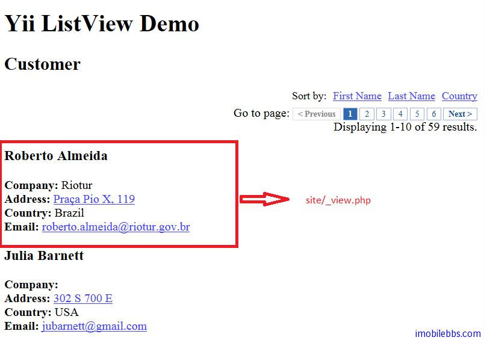

# Yii Framework 开发教程(30) Zii 组件-ListView 示例

CListView 可以用来显示列表，CListView 支持使用自定义的 View 模板显示列表的的记录，因此可以非常灵活的显示数据的表，这点有点像 Android 的 ListView：-）。

CListView 支持分页和排序，分页和排序支持使用 AJAX 实现从而可以提高页面的响应性能。CListView 的使用需要通过 [DataProvider](http://www.imobilebbs.com/wordpress/archives/4058)，通常是使用 CActiveDataProvider。

本例修改 [Yii Framework 开发教程(26) 数据库-Active Record 示例](http://www.imobilebbs.com/wordpress/archives/4047)，不过为了显示分页，我们使用 Customer 数据库表，每页显示 10 条记录。

修改缺省的视图 protected/views/site/index.php,使用 ListView 组件。

```

    <?php $this->widget('zii.widgets.CListView', array(
    	'dataProvider'=>$dataProvider,
    	'ajaxUpdate'=>false,
    	'template'=>'{sorter}{pager}{summary}{items}{pager}',
    	'itemView'=>'_view',
    	'pager'=>array(
    				'maxButtonCount'=>'7',
    				),
    			'sortableAttributes'=>array(
    				'FirstName',
    				'LastName',
    				'Country',
    				),
    )); ?>

```

参数 template 配置页面显示的模板，支持的参数有 {summary}, {sorter}, {items} 和{pager}，分别对应于 ListView 的汇总，排序，列表项，分页控制。
参数 itemView 指明每个列表项对应的 View 显示。本例使用 site/_view.php ，定义如下：

```

    <div class="item">
    
    <h3><?php echo CHtml::encode($data->FirstName . ' ' . $data->LastName);?></h3>
    
    <b><?php echo CHtml::encode($data->getAttributeLabel('Company')); ?>:</b>
    <?php echo CHtml::encode($data->Company); ?>
    <br />
    
    <b><?php echo CHtml::encode($data->getAttributeLabel('Address')); ?>:</b>
    <?php echo Yii::app()->format->formatUrl($data->Address); ?>
    <br />
    
    <b><?php echo CHtml::encode($data->getAttributeLabel('Country')); ?>:</b>
    <?php echo CHtml::encode($data->Country); ?>
    <br />
    
    <b><?php echo CHtml::encode($data->getAttributeLabel('Email')); ?>:</b>
    <?php echo Yii::app()->format->formatEmail($data->Email); ?>
    <br />
    
    </div>

```

然后修改 SiteController 的 indexAction 方法：

```

    public function actionIndex()
    {
    
    	$dataProvider=new CActiveDataProvider('Customer', array(
    		'pagination'=>array(
    			'pageSize'=>10,
    			'pageVar'=>'page',
    		),
    				'sort'=>array(
    					'defaultOrder'=>'Lastname',
    					),
    				));
    	$this->render('index',array(
    		'dataProvider'=>$dataProvider,
    		));
    }

```

创建 CActiveDataProvider，并配置分页和排序参数（pagination和sort），指明 ActiveDataProvider 取自 Customer ActiveRecord.

显示结果如下：



本例[下载](http://www.imobilebbs.com/download/yii/ListViewDemo.zip)

Tags: [PHP](http://www.imobilebbs.com/wordpress/archives/tag/php), [Yii](http://www.imobilebbs.com/wordpress/archives/tag/yii)

 

