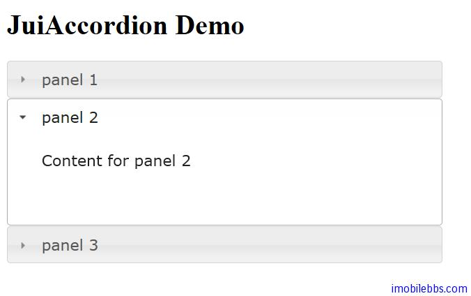

# Yii Framework 开发教程(33) Zii 组件-Accordion 示例

Zii 组件中包含了一些基于 JQuery 的 UI 组件，这些 UI 组件定义在包 [zii.widgets.jui](http://www.yiiframework.com/doc/api/1.1/#zii.widgets.jui) 中，包括 CJuiAccordion ，CJuiAutoComplete，CJuiDatePicker 等。本篇介绍 CJuiAccordion，显示一个 Accordion 组件（类似手风琴可以折叠的 UI 组件）。这个控件封装了 [JUI Accordion](http://jqueryui.com/demos/accordion/) 插件。

基本用法如下：

```

    <?php
    $this->widget('zii.widgets.jui.CJuiAccordion', array(
    	'panels'=>array(
    				'panel 1'=>'Content for panel 1',
    				'panel 2'=>'Content for panel 2',
    				'panel 3'=>$this->renderPartial('_content1',null,true),
    				),
    			'options'=>array(
    				'collapsible'=>true,
    				'active'=>1,
    				),
    			'htmlOptions'=>array(
    				'style'=>'width:500px;'
    				),
    			));
    
    ?>

```

通过定义 panels 属性定义 Accordion 的几个可折叠的页面，通过配置 options 传送参数给 JUI Accordion 插件。



本例[下载](http://www.imobilebbs.com/download/yii/JuiAccordionDemo.zip)

Tags: [PHP](http://www.imobilebbs.com/wordpress/archives/tag/php), [Yii](http://www.imobilebbs.com/wordpress/archives/tag/yii)


    

 


