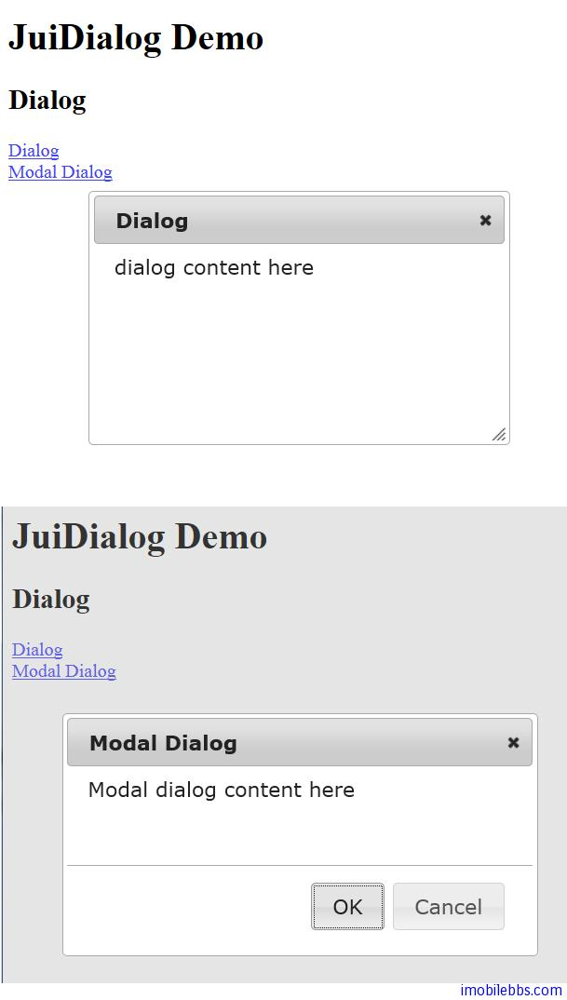

# Yii Framework 开发教程(37) Zii 组件-Dialog 示例

CJuiDialog 用来显示对话框，模式或非模式对话框。它封装了 [JUI Dialog](http://jqueryui.com/demos/dialog/) 插件。

其基本用法如下：

```

    <h2><?php echo 'Dialog';?></h2>
    
    <?php
    $this->beginWidget('zii.widgets.jui.CJuiDialog', array(
    	'id'=>'mydialog',
    	'options'=>array(
    				'title'=>'Dialog',
    				'width'=>500,
    				'height'=>300,
    				'autoOpen'=>false,
    				),
    			));
    echo 'dialog content here';
    $this->endWidget('zii.widgets.jui.CJuiDialog');
    ?>
    
    <?php echo CHtml::link('Dialog', '#',
    array('onclick'=>'$("#mydialog").dialog("open"); return false;')); ?>
    
    <br />
    
    <?php
    $this->beginWidget('zii.widgets.jui.CJuiDialog', array(
    	'id'=>'mymodal',
    	'options'=>array(
    				'title'=>'Modal Dialog',
    				'width'=>400,
    				'height'=>200,
    				'autoOpen'=>false,
    				'resizable'=>false,
    				'modal'=>true,
    				'overlay'=>array(
    					'backgroundColor'=>'#000',
    					'opacity'=>'0.5'
    					),
    				'buttons'=>array(
    					'OK'=>'js:function(){alert("OK");}',
    					'Cancel'=>'js:function(){$(this).dialog("close");}',
    					),
    				),
    			));
    echo 'Modal dialog content here ';
    $this->endWidget('zii.widgets.jui.CJuiDialog');
    ?>
    
    <?php echo CHtml::link('Modal Dialog', '#',
    array('onclick'=>'$("#mymodal").dialog("open"); return false;')); ?>
    

```

模式和非模式通过设置’modal’=>true/false 来配置，CJuiDialog 用来定义对话框，要显示对话框，还是需要通过其它 UI 组件，本例通过 Link 来显示对话框。



本例[下载](http://www.imobilebbs.com/download/yii/JuiDialogDemo.zip)

Tags: [PHP](http://www.imobilebbs.com/wordpress/archives/tag/php), [Yii](http://www.imobilebbs.com/wordpress/archives/tag/yii)