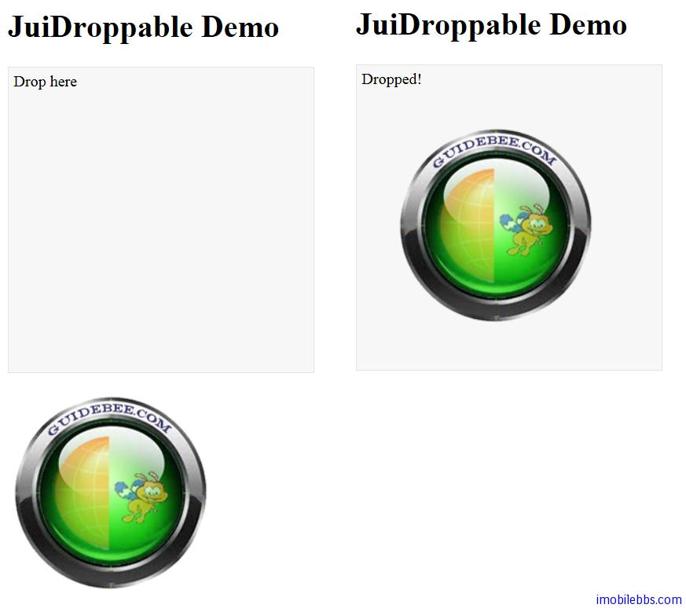

# Yii Framework 开发教程(43) Zii 组件-Droppable 示例

上篇介绍如果使用 UI 组件支持拖放，CJuiDroppable 表示某个区域可以接受拖拉过来的 UI 组件，它封装了 [JUI Droppable](http://jqueryui.com/demos/droppable/) 插件。

我们修改上例，添加一个 Droppable 区域，当有 UI 组件拖放到该区域时，显示“Dropped”。

```

    <?php $this->beginWidget('zii.widgets.jui.CJuiDroppable', array(
    	'options'=>array(
    				'drop'=>'js:function(event,ui){$(this).html("Dropped!")}',
    				),
    			'htmlOptions'=>array(
    				'style'=>'width: 300px; height: 300px; padding:
    				5px; border: 1px solid #e3e3e3; background: #f7f7f7',
    				),
    			));
    echo 'Drop here';
    
    $this->endWidget();
    ?>

```



本例[下载](http://www.imobilebbs.com/download/yii/JuiDroppableDemo.zip)

Tags: [PHP](http://www.imobilebbs.com/wordpress/archives/tag/php), [Yii](http://www.imobilebbs.com/wordpress/archives/tag/yii)

