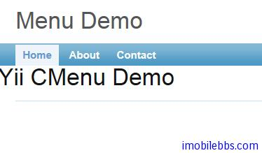
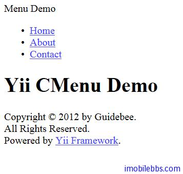

# Yii Framework 开发教程(29) Zii组件-Menu 示例

介绍完 Yii 数据库接口外，从本篇开始介绍 Zii 组件，包括列表视图 ListView，表格视图 GridView，此外还包括一些基于 JQuery 的 UI 组件，如 AutoComplete,DataPicker, Button, Drag 和 Drop 等。

本文介绍 Menu 菜单用法，CMenu 使用 Html 列表显示多级菜单，Menu 配置通过其属性 item 来配置，每个菜单项包括三个主要属性

- visible  是否可见
- active 当前菜单项是否选中，
- items 子菜单项。

此外还包括如下属性：

- label: 可选，菜单名称，支持使用 HTML 标记.
- url: 可选，点击该菜单转的 URL 链接
- template: 可选，菜单模板
- linkOptions: array, 可选，额外的 HTML 链接属性
- itemOptions: array, 可选，额外的显示菜单项的 HTML 属性。
- submenuOptions: array, 可选，额外显示子菜单的 HTML 属性.

一般可以把 Menu 定义在 Layout 布局中，比如本例，修改 protected/views/layout/main.php

```

    <?php $this->widget('zii.widgets.CMenu',array(
    		'items'=>array(
    					array('label'=>'Home',
    						'url'=>array('/site/index')),
    					array('label'=>'About',
    						'url'=>array('/site/page',
    						'view'=>'about')),
    					array('label'=>'Contact',
    						'url'=>array('/site/page',
    						'view'=>'contact')),
    					array('label'=>'Login',
    						'url'=>array('/site/login'),
    						'visible'=>false),
    					),
    	)); ?>
    
```

本例使用 CViewAction 来显示几个静态页面，静态页面的缺省目录为当前 Controller 的 View 目录下的 pages 子目录，本例在 pages 目录下创建了两个静态页面 about.php, contact.

要使用 CViewAction 来显示静态页面，需要修改 Controller 的 actions 方法：

```

    public function actions()
    {
    	return array(
    		'page'=>array(
    			'class'=>'CViewAction',
    			)
    		);
    }
    
```

此外如果要显示菜单的层次轨迹（breadcrumbs），可以使用 Zii 组件中的 CBreadcrumbs 组件，CBreadcrumbs 一般配合 CMenu 使用：

```

    <?php if(isset($this->breadcrumbs)):?>
    	<?php $this->widget('zii.widgets.CBreadcrumbs', array(
    			'links'=>$this->breadcrumbs,
    	)); ?><!-- breadcrumbs -->
    <?php endif?>

```

本例使用 Yii 缺省的 CSS，显示结果如下：



如果不使用 CSS，显示结果如下：



由此可见，需要同时使用 CMenu 组件配合合适的 CSS 才能显示漂亮的菜单。

本例[下载](http://www.imobilebbs.com/download/yii/MenuDemo.zip)

Tags: [PHP](http://www.imobilebbs.com/wordpress/archives/tag/php), [Yii](http://www.imobilebbs.com/wordpress/archives/tag/yii)


    


