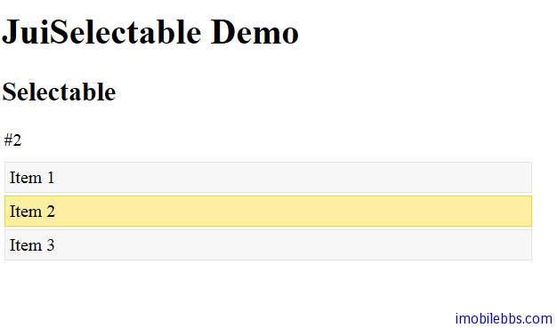

# Yii Framework 开发教程(45) Zii 组件-Selectable 示例

CJuiSelectable 可以显示一个列表，列表的每个项支持 Select 事件，它封装了 [JUI Selectable](http://jqueryui.com/demos/selectable/) 插件，其基本用法如下：

```

    <?php
    Yii::app()->clientScript->registerCss('selectable',"
    #selectable {list-style-type: none; margin: 0; padding: 0; width: 60%;}
    #selectable li {margin: 2px; padding: 4px; border: 1px solid #e3e3e3; background: #f7f7f7}
    #selectable .ui-selecting { border: 1px solid #fad42e; }
    #selectable .ui-selected { border: 1px solid #fad42e; background: #fcefa1;}
    #select-result {margin: 0 0 10px 2px; }
    ", 'screen', CClientScript::POS_HEAD);
    ?>
    
    <h2><?php echo 'Selectable'; ?></h2>
    
    <div id="select-result">none</div>
    
    <?php
    $this->widget('zii.widgets.jui.CJuiSelectable',array(
    	'id'=>'selectable',
    	'items'=>array(
    				'id1'=>'Item 1',
    				'id2'=>'Item 2',
    				'id3'=>'Item 3'
    				),
    			'options'=>array(
    				'stop'=>'js: function(event,ui){
    			var result = $("#select-result").empty();
    			$(".ui-selected", this).each(function(){
    				var index = $("#selectable li").index(this);
    				result.append(" #" + (index + 1));
    			});
    		}'
    				)
    			));
    ?>

```
使用 Javascipts 来响应选择事件。



本例[下载](http://www.imobilebbs.com/download/yii/JuiSelectableDemo.zip)

Tags: [PHP](http://www.imobilebbs.com/wordpress/archives/tag/php), [Yii](http://www.imobilebbs.com/wordpress/archives/tag/yii)
