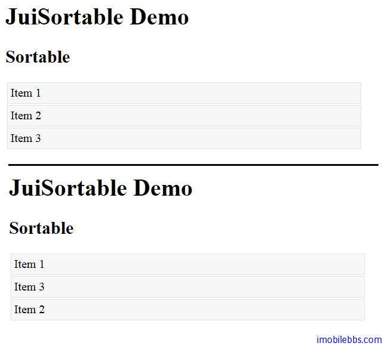

# Yii Framework 开发教程(46) Zii 组件-Sortable 示例

CJuiSortable 显示一个列表，列表中的列表项可以通过拖放重新调整顺序，它封装了 [JUI Sortable](http://jqueryui.com/demos/sortable/) 插件。

其基本用法如下：

```

    <?php
    Yii::app()->clientScript->registerCss('sortable', "
    #sortable {list-style-type: none; margin: 0; padding: 0; width: 60%;}
    #sortable li {margin: 2px; padding: 4px;
    border: 1px solid #e3e3e3; background: #f7f7f7}
    ", 'screen', CClientScript::POS_HEAD);
    ?>
    
    <h2><?php echo Yii::t('ui','Sortable');?></h2>
    
    <?php $this->widget('zii.widgets.jui.CJuiSortable', array(
    	'id'=>'sortable',
    	'items'=>array(
    		'id1'=>'Item 1',
    		'id2'=>'Item 2',
    		'id3'=>'Item 3',
    	),
    	'options'=>array(
    		'cursor'=>'n-resize',
    	),
    ));
    ?>

```



本例[下载](http://www.imobilebbs.com/download/yii/JuiSortableDemo.zip)

Tags: [PHP](http://www.imobilebbs.com/wordpress/archives/tag/php), [Yii](http://www.imobilebbs.com/wordpress/archives/tag/yii)
