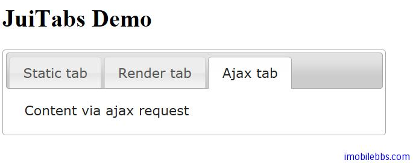

# Yii Framework 开发教程(41) Zii 组件-Tabs 示例

CJuiTabs 显示分页 UI 组件，和 [Yii Framework 开发教程(17) UI 组件 TabView 示例](ui-components-tabview-example.md)功能类似，它封装了 [JUI tabs](http://jqueryui.com/demos/tabs/) 插件。

前基本用法如下：

```

    <?php $this->widget('zii.widgets.jui.CJuiTabs', array(
    'tabs'=>array(
    	'Static tab'=>'Static content',
    	'Render tab'=>$this->renderPartial('pages/_content1',null,true),
    	'Ajax tab'=>array('ajax'=>array('ajaxContent','view'=>'_content2')),
    	),
    'options'=>array(
    	'collapsible'=>true,
    	'selected'=>1,
    	),
    'htmlOptions'=>array(
    	'style'=>'width:500px;'
    	),
    )); ?>

```

显示了三个页面不同内容显示方法，Static Tab 显示一个静态内容，Render Tab 使用 Partial 渲染一个页面，而 Ajax Tab 则通过 AJAX 显示一个页面，注意后面两个需要在 SiteController 中定义 Actions 如下：

```

    public function actions()
    {
    	return array(
    		'page'=>array(
    				'class'=>'CViewAction',
    				),
    		// ajaxContent action renders
    		//"static" pages stored under 'protected/views/site/pages'
    		// They can be accessed via:
    		//index.php?r=site/ajaxContent&view=FileName
    		'ajaxContent'=>array(
    				'class'=>'application.controllers.AjaxViewAction',
    			),
    		);
    }

```

其中 AjaxViewAction 为一自定义 ViewAction，为 CViewAction 的子类，可以显示静态页面，其定义如下：

```

    class AjaxViewAction extends CViewAction
    {
    	private $_viewPath;
    
    	public function run()
    	{
    		if(Yii::app()->request->isAjaxRequest)
    		{
    			$this->resolveView($this->getRequestedView());
    			$controller=$this->getController();
    			$controller->renderPartial($this->view, null, false, true);
    		}
    		else
    			throw new CHttpException(400,'Invalid request.
    		   Please do not repeat this request again.');
    	}
    }

```

显示结果如下：



本例[下载](http://www.imobilebbs.com/download/yii/JuiTabsDemo.zip)

Tags: [PHP](http://www.imobilebbs.com/wordpress/archives/tag/php), [Yii](http://www.imobilebbs.com/wordpress/archives/tag/yii)