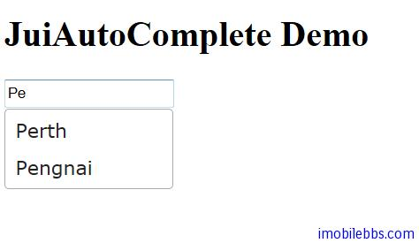

# Yii Framework 开发教程(34) Zii 组件-AutoComplete 示例

CJuiAutoComplete 在用户输入时可以根据用户输入的前几个字符自动提示用户可以输入的文字。它封装了 [JUI autocomplete](http://jqueryui.com/demos/autocomplete/) 插件。

基本用法如下：

```

    <?php
    $this->widget('zii.widgets.jui.CJuiAutoComplete', array(
    	'name'=>'city',
    	'source'=>$data,
    	// additional javascript options for the autocomplete plugin
    	'options'=>array(
    				'minLength'=>'2',
    				),
    			'htmlOptions'=>array(
    				'style'=>'height:20px;'
    				),
    			));
    
    ?>

```

自动提示的数据源通过配置 source 属性来完成，实际应用时可以通过读取数据库，文件等。本例为简单起见，使用一个数组定义在 SiteController 中。

```

    public function actionIndex()
    {
    
    	$data=array('Nanjing', 'Beijing', 'Perth',
    		'Chicago','Paris','Pengnai','Sydney');
    
    	$this->render('index', array(
    		'data' => $data,
    
    			));
    }

```



本例[下载](http://www.imobilebbs.com/download/yii/JuiAutoCompleteDemo.zip)

Tags: [PHP](http://www.imobilebbs.com/wordpress/archives/tag/php), [Yii](http://www.imobilebbs.com/wordpress/archives/tag/yii)


 