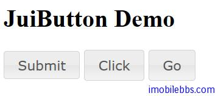
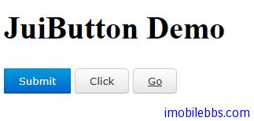

# Yii Framework 开发教程(35) Zii 组件-Button 示例

CJuiButton 显示按钮，CJuiButton 既可以做为 Submit（提交）按钮，也可以做为普通按钮。
按钮基本用法如下：

```

    <?php $this->widget('zii.widgets.jui.CJuiButton', array(
    'buttonType'=>'submit',
    'name'=>'btnSubmit',
    'value'=>'1',
    'caption'=>'Submit',
    'htmlOptions'=>array('class'=>'ui-button-primary')
    )); ?>
    
    <?php $this->widget('zii.widgets.jui.CJuiButton', array(
    	'buttonType'=>'button',
    	'name'=>'btnClick',
    	'caption'=>'Click',
    	//'options'=>array('icons'=>'js:{primary:"ui-icon-newwin"}'),
    	'onclick'=>'js:function(){alert("clicked"); this.blur(); return false;}',
    )); ?>
    
    <?php $this->widget('zii.widgets.jui.CJuiButton', array(
    'buttonType'=>'link',
    'name'=>'btnGo',
    'caption'=>'Go',
    //'options'=>array('icons'=>'js:{secondary:"ui-icon-extlink"}'),
    'url'=>array('site/other'),
    )); ?>

```

这三个按钮，第一个做为 Submit 按钮，第二个作为普通按钮，触发 JavaScripts 事件，第三个点击后触发 otherAction 方法。

显示结果如下：



可以为 Jui UI 组件添加 CSS 文件，这可以通过配置文件来设置 CSS 文件：

```

    'components'=>array(
    	'clientScript' => array(
    			'scriptMap' => array(
    				'jquery-ui.css'=> dirname($_SERVER['SCRIPT_NAME'])
    				  .'/css/jui/custom/jquery-ui.css',
    				),
    			),
    		),

```

这里我们复制 YiiPlayground 使用的 JQuery CSS 文件 ，使用新 CSS 风格后显示如下：




本例[下载](http://www.imobilebbs.com/download/yii/JuiButtonDemo.zip)

Tags: [PHP](http://www.imobilebbs.com/wordpress/archives/tag/php), [Yii](http://www.imobilebbs.com/wordpress/archives/tag/yii)
