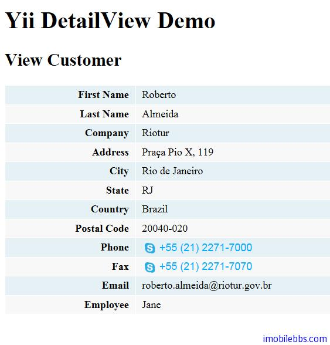

# Yii Framework 开发教程(31) Zii 组件-DetailView 示例

CDetailView 为某个 Model 显示详细内容。这个要显示的 Model 可以为 CModel 或是关联数组。

CDetailView 通过配置 [attributes](http://www.yiiframework.com/doc/api/1.1/CDetailView#attributes) 来决定 Model 的那些属性需要显示已经以何种格式显示。

每个属性可以使用 Name:Type:Label 来配置。其中 Type 和 Label 都是可选的。

- ame” 属性名称.
- “Label” 可以选，属性的标签名，如果没有配置，则使用属性名称做为标签名称.
- “Type” 属性的类型，通过类型来决定显示的格式 [formatter](http://www.yiiframework.com/doc/api/1.1/CDetailView#formatter).可以使用的类型有 raw, text, ntext, html, date, time, datetime, boolean, number, email, image, url. 等，缺省使用 text.

本例修改上例 [Yii Framework 开发教程(30) Zii 组件-ListView 示例](http://www.imobilebbs.com/wordpress/archives/4069) ，修改显示列表的列表项模版_view.php ，使客户名称由普通文字变为 Link。

```

    <h3><?php echo CHtml::link($data->FirstName . ' ' . $data->LastName,
    $this->createUrl('view',array('CustomerId'=>$data->CustomerId)));?></h3>

```

当点击客户姓名时，转到链接 view.php, 传入参数 CustomerId 设为 Customer 的 ID。

创建 View.php，使用 CDetailView 组件

```
    
    <h2><?php echo 'View Customer'; ?></h2>
    
    <?php $this->widget('zii.widgets.CDetailView', array(
    	'data'=>$model,
    	'attributes'=>array(
    
    				'FirstName',
    				'LastName',
    				'Company',
    				'Address',
    				'City',
    				'State',
    				'Country',
    				'PostalCode',
    				'Phone',
    				'Fax',
    				'Email',
    				array(
    					'name'=>'Employee',
    					'value'=>$model->employee->FirstName,
    					),
    
    				),
    			));
    ?>

```

使用缺省的格式显示 Customer 的每个字段，主要的 Employee 字段，表 Customer 定义的是 SupportRepId 做为外键参考 Employee，因此修改类 Customer 定义 Relations，参考 [Yii Framework 开发教程(27) 数据库-关联 Active Record 示例](http://www.imobilebbs.com/wordpress/archives/4052)

```

    public function relations()
    {
    	return array(
    		'employee'=>array(self::BELONGS_TO,
    		'Employee', 'SupportRepId'),
    		);
    }
    

```

显示结果如下：



本例[下载](http://www.imobilebbs.com/download/yii/DetailViewDemo.zip)

Tags: [PHP](http://www.imobilebbs.com/wordpress/archives/tag/php), [Yii](http://www.imobilebbs.com/wordpress/archives/tag/yii)


