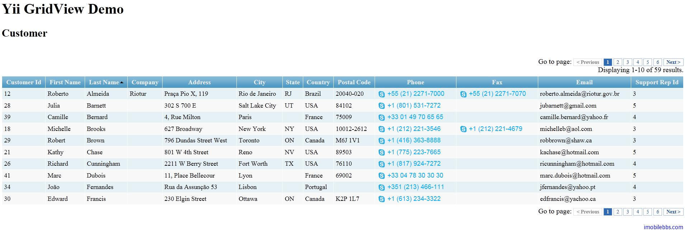
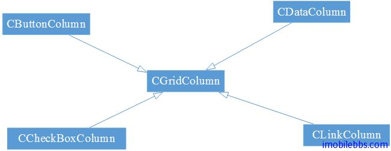
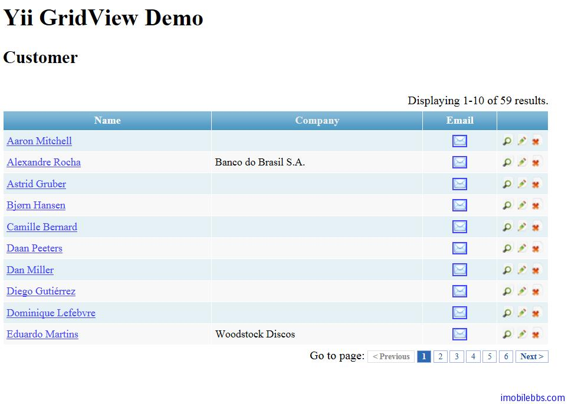

#  Yii Framework 開發教程(32) Zii 組件-GridView 示例

CGridView 以表格的形式顯示數據，CGridView 也支持分頁和排序，CGridView 最基本的用法和 ListView 類型，也是通過設置 [data provider](http://www.yiiframework.com/doc/api/1.1/IDataProvider)，通常是 [CActiveDataProvider](http://www.yiiframework.com/doc/api/1.1/CActiveDataProvider)。

修改上個例子 [Yii Framework 開發教程(31) Zii 組件-DetailView 示例](Zii-components-the-DetailView-example.md)，把 ListView 該為 GridView：

```

    <?php $this->widget('zii.widgets.grid.CGridView', array(
    	'dataProvider'=>$dataProvider,
    	'ajaxUpdate'=>false,
    	'template'=>'{pager}{summary}{items}{pager}',
    
    )); ?>

```

顯示結果如下：




可以看到 GridView 預設顯示了所有的欄位，並使用預設的格式顯示欄位，如果需要控制欄位顯示和格式，可以通過配置 [CGridView::columns](v) 屬性來實現。GridView 的每列為一個 CGridColumn 對象：



- CGridColumn 為所有 Grid 列表項的基類，表格的每例可以有一個表頭，多個數據單元，和一個可選的表尾單元格。
- CButtonColumn 表示該單元格為一個或多個按鈕，預設顯示三個按鈕， “view”, “update” 和”delete”,可以通過設置 [buttons](http://www.yiiframework.com/doc/api/1.1/CButtonColumn#buttons) 和 [template](http://www.yiiframework.com/doc/api/1.1/CButtonColumn#template) 來更改。
- CCheckBoxColumn 表示該單元格為 Checkbox，支持只讀，單選或多選，通過配置 [selectableRows](http://www.yiiframework.com/doc/api/1.1/CCheckBoxColumn#selectableRows) 來修改
- CDataColumn 表示該單元為數據或是表達式，通過配置 [name](http://www.yiiframework.com/doc/api/1.1/CDataColumn#name) 或 [value](http://www.yiiframework.com/doc/api/1.1/CDataColumn#value)，前者表示數據模型的屬性名稱，後者代碼一個 PHP 表達式。
- CLinkColumn 表示一個超鏈接，通過配置 [label](http://www.yiiframework.com/doc/api/1.1/CLinkColumn#label) ， [url](http://www.yiiframework.com/doc/api/1.1/CLinkColumn#url) 或 [imageUrl](http://www.yiiframework.com/doc/api/1.1/CLinkColumn#imageUrl) 來設置鏈接。

重新定義 GridView 的 columns 屬性如下：

```

    <?php $this->widget('zii.widgets.grid.CGridView', array(
    	'id'=>'person-grid',
    	'dataProvider'=>$dataProvider,
    	'htmlOptions'=>array('style'=>'width:740px'),
    	'pager'=>array(
    				'maxButtonCount'=>'7',
    				),
    			'columns'=>array(
    
    				array(
    					'header'=>'Name',
    					'type'=>'raw',
    					'value'=>'CHtml::link($data->FirstName .
    					 " " . $data->LastName,
    					 $this->grid->controller->createUrl
    					("view",array("CustomerId"=>$data->CustomerId)))',
    
    					),
    
    				'Company',
    
    				array(
    					'class'=>'CLinkColumn',
    					'header'=>'Email',
    					'imageUrl'=>'images/email.png',
    					'labelExpression'=>'$data->Email',
    					'urlExpression'=>'"mailto://".$data->Email',
    					'htmlOptions'=>array('style'=>'text-align:center'),
    					),
    				array(
    					'class'=>'CButtonColumn',
    					'deleteConfirmation'=>'Are you sure to delete this item?',
    					),
    				),
    
    ));
    ?>

```

顯示如下：



點擊姓名可以顯示 DetailView。 ButtonColumn 的 update,search,delete 沒有添加對應的 view ，就留給你自己加上了。

本例[下載](http://www.imobilebbs.com/download/yii/DetailViewDemo.zip)

Tags: [PHP](http://www.imobilebbs.com/wordpress/archives/tag/php), [Yii](http://www.imobilebbs.com/wordpress/archives/tag/yii)


    