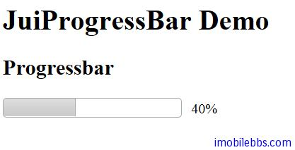

# Yii Framework 开发教程(38) Zii 组件-ProgressBar 示例

CJuiProgressBar 显示一进度条。它封装了 [JUI Progressbar](http://jqueryui.com/demos/progressbar/) 插件。

```

    <?php $this->widget('zii.widgets.jui.CJuiProgressBar', array(
    	'id'=>'progress',
    	'value'=>0,
    	'htmlOptions'=>array(
    				'style'=>'width:200px; height:20px; float:left;'
    				),
    			));
    ?>

```

为了演示进度条，我们使用 JavaScripts 改变进度条当前值，并使用一个文本显示当前进度条的值。

```

    <?php
    //  Dummy function just to provide an example
    Yii::app()->clientScript->registerScript('scriptId', "
    	var count = 0;
    	var step  = 10;
    	var speed = 500;
    	function progress() {
    		$('#amount').text(count+'%');
    		$('#progress').progressbar('option', 'value', count);
    		if(count < 100) {
    			count = count+step;
    			setTimeout(progress, speed);
    		}
    	}
    	progress();
    ", CClientScript::POS_LOAD);
    ?>
    ...
    
    <div id="amount" style="margin-left:210px; padding:3px;"></div>

```



本例[下载](http://www.imobilebbs.com/download/yii/JuiProgressBarDemo.zip)

Tags: [PHP](http://www.imobilebbs.com/wordpress/archives/tag/php), [Yii](http://www.imobilebbs.com/wordpress/archives/tag/yii)

 