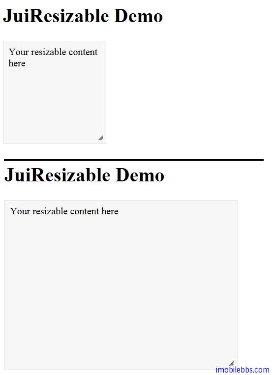

# Yii Framework 开发教程(44) Zii 组件-Resizable 示例

CJuiResizable 可以使包含在其中的 UI 组件支持缩放功能，它封装了 [JUI Resizable](http://jqueryui.com/demos/resizable/) 插件，

CJuiResizable 基本使用方法如下：

```

    <?php $this->beginWidget('zii.widgets.jui.CJuiResizable', array(
    	'options'=>array(
    				'minWidth'=>50,
    				'minHeight'=>50,
    				'maxWidth'=>500,
    				'maxHeight'=>500,
    				),
    			'htmlOptions'=>array(
    				'style'=>'width: 150px; height: 150px;
    				 padding: 0.5em; border: 1px solid #e3e3e3; background: #f7f7f7'
    				),
    			));
    echo 'Your resizable content here';
    
    $this->endWidget();
    ?>
    

```

把需要支持缩放功能的内容定义在 CJuiResizable 的 beginWidget 和 endWidget 直接就可以实现缩放功能。




本例[下载](http://www.imobilebbs.com/download/yii/JuiResizableDemo.zip)

Tags: [PHP](http://www.imobilebbs.com/wordpress/archives/tag/php), [Yii](http://www.imobilebbs.com/wordpress/archives/tag/yii)
