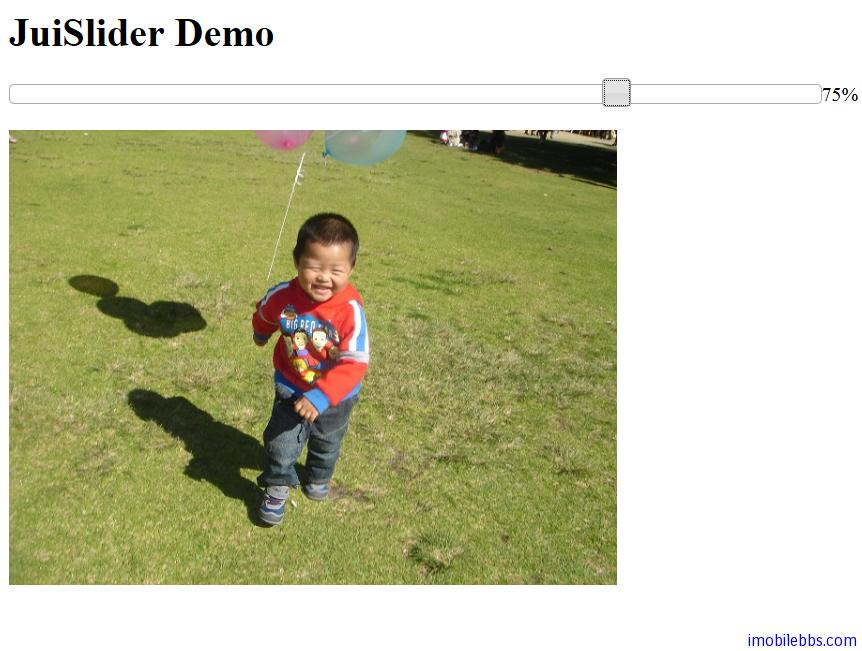

# Yii Framework 开发教程(39) Zii 组件-Slider 示例

CJuiSlider 显示一滑动条，可以通过滑动条来缩放图像或用作其它功能，它封装了 [JUI slider](http://jqueryui.com/demos/slider/) 插件。

本例通过 CJuiSlider 来缩放一副图像：

```

    <?php $this->widget('zii.widgets.jui.CJuiSlider', array(
    	'value'=>50,
    	'options'=>array(
    				'min'=>1,
    				'max'=>100,
    				'slide'=>'js:
    			function(event,ui){
    				$("#image").width(648*ui.value/100);
    				$("#zoom").text(ui.value+"%");
    			}
    		',
    				),
    			'htmlOptions'=>array(
    				'style'=>'width:648px; float:left;'
    				),
    )); ?>
    
    <div id="zoom" >50%</div>
    <br />
    
    

```



本例[下载](http://www.imobilebbs.com/download/yii/JuiSliderDemo.zip)

Tags: [PHP](http://www.imobilebbs.com/wordpress/archives/tag/php), [Yii](http://www.imobilebbs.com/wordpress/archives/tag/yii)

