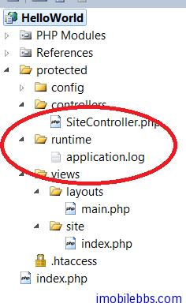

# Yii Framework 开发教程(3) 为应用添加日志

在开发应用的过程中，调试也是非常重要的一个环节，除了 IDE 支持的即时调试（如 VS.PHP 或 IDE 支持的调试功能），给 Web 应用添加适当的调试信息也是非常有用的一个方法，开发过 Java 或.Net 应用的对 log4XX 都不陌生，Yii Framework 中也提供了类似的 Log 功能， [Yii::log](http://www.yiiframework.com/doc/api/1.1/Yii#log)，它是作为 CWebApplication 一个内置的组件出现的。可以通过配置文件来配置（Yii 中配置通常为  protected/config/main.php）。

上篇文章 [Yii Framework 开发简明教程(2) Yii Web应用基础](yii-web-application-base.md)简述了应用组件。

除 Log 组件外，Yii 预定义了一系列核心应用组件，提供常见 Web 应用中所用的功能。例如， [request](http://www.yiiframework.com/doc/api/1.1/CWebApplication#request) 组件用于解析用户请求并提供例如 URL，cookie 等信息。 通过配置这些核心组件的属性，我们可以在几乎所有的方面修改 Yii 的默认行为。

下面我们列出了由 [CWebApplication](http://www.yiiframework.com/doc/api/1.1/CWebApplication) 预定义的核心组件。

- [assetManager](http://www.yiiframework.com/doc/api/1.1/CWebApplication#assetManager-detail): [CAssetManager](http://www.yiiframework.com/doc/api/1.1/CAssetManager) – 管理私有资源文件的发布。
- [authManager](http://www.yiiframework.com/doc/api/1.1/CWebApplication#authManager-detail): [CAuthManager](http://www.yiiframework.com/doc/api/1.1/CAuthManager) – 管理基于角色的访问控制 (RBAC).
- [cache](http://www.yiiframework.com/doc/api/1.1/CApplication#cache-detail): [CCache](http://www.yiiframework.com/doc/api/1.1/CCache) – 提供数据缓存功能。注意，你必须指定实际的类（例如 [CMemCache](http://www.yiiframework.com/doc/api/1.1/CMemCache), [CDbCache](http://www.yiiframework.com/doc/api/1.1/CDbCache)）。 否则，当你访问此组件时将返回 NULL。
- [clientScript](http://www.yiiframework.com/doc/api/1.1/CWebApplication#clientScript-detail): [CClientScript](http://www.yiiframework.com/doc/api/1.1/CClientScript) – 管理客户端脚本 (javascripts 和 CSS).
- [coreMessages](http://www.yiiframework.com/doc/api/1.1/CApplication#coreMessages-detail): [CPhpMessageSource](http://www.yiiframework.com/doc/api/1.1/CPhpMessageSource) – 提供 Yii 框架用到的核心信息的翻译。
- [db](http://www.yiiframework.com/doc/api/1.1/CApplication#db-detail): [CDbConnection](http://www.yiiframework.com/doc/api/1.1/CDbConnection) – 提供数据库连接。注意，使用此组件你必须配置其 [connectionString]() 属性。
- [errorHandler](http://www.yiiframework.com/doc/api/1.1/CApplication#errorHandler-detail): [CErrorHandler](http://www.yiiframework.com/doc/api/1.1/CErrorHandler) – 处理未捕获的 PHP 错误和异常。
- [format](http://www.yiiframework.com/doc/api/1.1/CApplication#format): [CFormatter](http://www.yiiframework.com/doc/api/1.1/CFormatter) – 格式化数值显示。此功能从版本 1.1.0 起开始提供。
- [messages](http://www.yiiframework.com/doc/api/1.1/CApplication#messages-detail): [CPhpMessageSource](http://www.yiiframework.com/doc/api/1.1/CPhpMessageSource) – 提供 Yii 应用中使用的信息翻译。
- [request](http://www.yiiframework.com/doc/api/1.1/CApplication#request-detail): [CHttpRequest](http://www.yiiframework.com/doc/api/1.1/CHttpRequest) – 提供关于用户请求的信息。
- [securityManager](http://www.yiiframework.com/doc/api/1.1/CApplication#securityManager-detail): [CSecurityManager](http://www.yiiframework.com/doc/api/1.1/CSecurityManager) – 提供安全相关的服务，例如散列，加密。
- [session](http://www.yiiframework.com/doc/api/1.1/CWebApplication#session-detail): [CHttpSession](http://www.yiiframework.com/doc/api/1.1/CHttpSession) – 提供 session 相关的功能。
- [statePersister](http://www.yiiframework.com/doc/api/1.1/CApplication#statePersister-detail): [CStatePersister](http://www.yiiframework.com/doc/api/1.1/CStatePersister) – 提供全局状态持久方法。
- [urlManager](http://www.yiiframework.com/doc/api/1.1/CApplication#urlManager-detail): [CUrlManager](http://www.yiiframework.com/doc/api/1.1/CUrlManager) – 提供 URL 解析和创建相关功能
- [user](http://www.yiiframework.com/doc/api/1.1/CWebApplication#user-detail): [CWebUser](http://www.yiiframework.com/doc/api/1.1/CWebUser) – 提供当前用户的识别信息。
- [themeManager](http://www.yiiframework.com/doc/api/1.1/CWebApplication#themeManager-detail): [CThemeManager](http://www.yiiframework.com/doc/api/1.1/CThemeManager) – 管理主题。

这些组件在后面的教程中将逐步介绍。下面给出 Log  功能使用的基本方法：这里我们修改 [Yii Framework 开发简明教程(1) 第一个应用Hello World](http://www.imobilebbs.com/wordpress/archives/3854)。为其添加日志。

1.创建配置文件 protected/config/main.php

希望将日志写到一个文件中，可以使用如下配置：

```

    <?php
 

    // This is the main Web application configuration. Any writable

    // CWebApplication properties can be configured here.

    return array(

    // preloading 'log' component
    'preload'=>array('log'),
    // application components

    'components'=>array(
   
        'log'=>array(

            'class'=>'CLogRouter',

            'routes'=>array(
                array(
                    'class'=>'CFileLogRoute',
                    'levels'=>'info,error, warning',
                    ),
 
                ),
            ),
        ),
 
    );
```

CLogRouter 信息路由 通过 Yii::log 或 Yii::trace 记录的信息是保存在内存中的。 我们通常需要将它们显示到浏览器窗口中，或者将他们保存到一些 持久存储例如文件、Email 中。这个就叫作信息路由。
一般使用 Log 功能时，需要预先载入 Log 组件，这是通过 preload 来配置的，preload 允许应用事先载入一些模块.提示: 默认情况下，应用元件是根据需要而创建的。这意味着一个元件只有在被访问的情况下才会创建。 因此，系统的整体性能不会因为配置了很多元件而下降。有些应用元件，(比如 CLogRouter) 是不管用不用都要创建的。在这种情况下， 我们在应用的配置文件里将这些元件的 ID 列上：preload。

2.修改入口脚本 index.php ，配置主应用实例使用新创建的配置文件。

```

    $yii='C:/yiiframework/yii.php';
    // remove the following line when in production mode
    defined('YII_DEBUG') or define('YII_DEBUG',true);
 
    $config=dirname(__FILE__).'/protected/config/main.php';
 
    require_once($yii);
    Yii::createWebApplication($config)->run();
```

3.创建 protected/runtime

4.这样就可以使用 Yii::log 或 Yii::trace 为应用添加日志。

其区别是后者只在当应用程序运行在 [调试模式(debug mode)](http://www.yiiframework.com/doc/guide/1.1/zh_cn/basics.entry#debug-mode) 中时才会记录信息。

```

    Yii::log($message, $level, $category);
    Yii::trace($message, $category);

```

当记录信息时，我们需要指定它的分类和级别 分类是一段格式类似于 [路径别名](http://www.yiiframework.com/doc/guide/1.1/zh_cn/basics.namespace) 的字符串。 例如，如果一条信息是在 [CController](http://www.yiiframework.com/doc/api/1.1/CController) 中记录的，我们可以使用 system.web.CController 作为分类。信息级别应该是下列值中的一种：
  
  - trace: 这是在 [Yii::trace](http://www.yiiframework.com/doc/api/1.1/YiiBase#trace-detail) 中使用的级别。它用于在开发中 跟踪程序的执行流程。
  - info: 这个用于记录普通的信息。
  - profile: 这个是性能概述（profile）。下面马上会有更详细的说明。
  - warning: 这个用于警告（warning）信息。
  - error: 这个用于致命错误（fatal error）信息。

Yii 的日志通过 Level 和 Category 进行分类和过滤，正如我们所提到的， 多个级别或分类应使用逗号连接。
由于信息分类是类似 xxx.yyy.zzz 格式的，我们可以将其视为一个分类层级。 具体地，我们说 xxx 是 xxx.yyy 的父级，而 xxx.yyy 又是 xxx.yyy.zzz 的父级。 这样我们就可以使用 xxx.* 表示分类 xxx 及其所有的子级和孙级分类。

有了以上知识，我们修改 SiteController 的 actionIndex,添加一行日志。

```
    
    public function actionIndex()
    {
        Yii::log("action","info","site.action");
         $this->render("index");
    }

```

5.运行应用，可以看到 Yii 在 protected/runtime 创建了一个 application.log



其内容如下：
2012/12/11 21:23:38 [info] [site.action] action

注： 日志存放的位置和文件名都可以通过配置来修改，一般情况使用缺省值就可以了，和 log4X 类似，应用的日志可以通过路由同时写到多个目的地（文件，Email 等）这些多可以通过配置来实现，具体可以参见[日志记录](http://www.yiiframework.com/doc/guide/1.1/zh_cn/topics.logging)。

Tags: [PHP](http://www.imobilebbs.com/wordpress/archives/tag/php), [Yii](http://www.imobilebbs.com/wordpress/archives/tag/yii)

 
