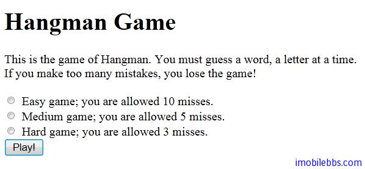

# Yii Framework 开发教程(7) 使用 CHtml 创建 Form

在创建 Yii 应用的 MVC 做的 View 时，可以直接使用 HTML 语言直接构造页面视图，Yii 也提供了几个帮助（helper）类简化视图编写。例如， 要创建一个文本输入域，我们可以调用 CHtml::textField()； 要创建一个下拉列表，则调用 CHtml::dropDownList()。在前面的 Hangman 例子的几个 View 就是使用 CHtml 来创建 View 的。

信息: 你可能想知道使用帮助类的好处，如果它们所需的代码量和直接写纯 HTML 的代码量相当的话。 答案就帮助类可以提供比 HTML 代码更多的功能。例如， 如下代码将生成一个文本输入域，它可以在用户修改了其值时触发表单提交动作。

    CHtml::textField($name,$value,array('submit'=>''));

不然的话你就需要写一大堆 JavaScript 。

回忆一下 Hangman 中页面 play 的定义：

```

    <p>This is the game of Hangman.
    You must guess a word, a letter at a time.
    If you make too many mistakes, you lose the game!</p>
    
    <?php echo CHtml::beginForm(); ?>
    
    <?php echo CHtml::radioButtonList('level', null, $levels); ?>
    
    <br/>
    <?php echo CHtml::submitButton('Play!'); ?>
    
    <?php if($error): ?>
    <span style="color:red">You must choose a difficulty level!</span>
    <?php endif; ?>
    
    <?php echo CHtml::endForm(); ?>

```



使用 CHtml 构造页面总是以 CHtml::beginForm()开始以 CHtml::endForm()结尾。实际上这两，个方法生成 From 标签的开始和结束标记。
对于 HTML 表单支持的 UI 组件，如 button, radioButton, checkbutton 等 UI 组件，CHtml 类都提供了对应的方法，比如上面的 radioButtonList 和 submitButton。

除 radioButtonList 等之外，CHtml 还提供了一组 activeXXX ,比如 activeRadioButtonList ，这些方法需要和 CFormModel 配合使用，对于 Hangman 这样的例子我们没有另外使用 Model，因此就没有使用 activeRadioButtonList 方法，将在后面介绍 MVC 中的 Model 时介绍。

对与 CHtml 所支持的全部 UI 组件可以参考 [Yii类参考文档](http://www.yiiframework.com/doc/api/1.1/CHtml)。

从版本 1.1.1 开始，提供了一个新的小物件 [CActiveForm](http://www.yiiframework.com/doc/api/1.1/CActiveForm) 以简化表单创建。 这个小物件可同时提供客户端及服务器端无缝的、一致的验证。这些在 Yii支持的 UI 组件时一并介绍。

Tags: [PHP](http://www.imobilebbs.com/wordpress/archives/tag/php), [Yii](http://www.imobilebbs.com/wordpress/archives/tag/yii)

 