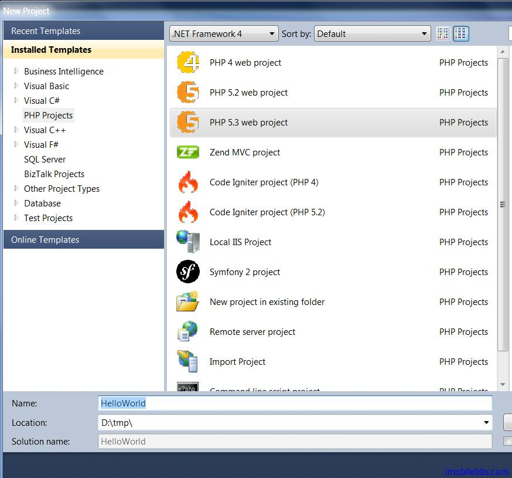

# Yii Framework 开发教程(1) 第一个应用 Hello World

Yii Framework 教程可以参见[官方中文文档](http://www.yiiframework.com/doc/guide/1.1/zh_cn/quickstart.installation) ，那么为什么还要写这个开发教程呢？ 本教程目的是通过不同的视角（主要是通过开发 Windows 应用 C++，C#程序员的角度）帮助 Windows 桌面应用或 ASP.Net 程序员较快的掌握 PHP Yii Framework 应用程序框架。 使用 PHP 开发 Web 应用的一个重要好处是可以应用于各种操作系统（Unix，Windows，Mac OS），而不像 Asp.Net 一般只能应用中 Windows 操作系统上。使用 PHP+Apache+MySQL （XMAP/LAMP) 几乎可以打遍天下无敌手：-）。

本教程所使用的操作系统为 Windows，开发 IDE 为 VS.PHP，之所以使用这个开发环境是因为 VS.PHP 采用 Visual Studio 作为 IDE ,对于 Visual Studio 开发人员比较熟悉。而且可以用来同时开发调试 C#,PHP 应用。 Yii Framework 本身和 IDE 无关，你可以使用你喜欢的 PHP 开发工具来开发 Yii 应用（比如 Eclipse）。关于 VS.PHP 的介绍可以参见 [VS.PHP + YiiFramework](http://www.imobilebbs.com/wordpress/archives/3829) 组合开发 PHP 应用。本教程关于 Yii Framework 知识也和开发 IDE 无关，可以应用到各种开发环境，你可以选择你自己喜欢的开发环境。

在创建第一个应用之间，需要下载 Yii 开发包，下载可以到 Yii 网站 http://www.yiiframework.com/download/ 下载，目前版本为 1.1.12， 下载后直接解压，为方便起见将其解压到 C:根目录下：


使用 VS.PHP 的还有一个好处是其自带了 Apache Web 服务器，因此无需另外安装，你也可以安装 [XAMP](http://xampp.en.softonic.com/mac) (Apache+MySQL+PHP) ，但如需要使用 MySQL，则另外需安装 [MySQL](http://dev.mysql.com/downloads/mysql/).

安装好 Yii Framework 之后，我们就使用 VS.PHP 来创建第一个 PHP 应用，Hello World。



VS.PHP 创建 HelloWorld 项目，并添加一个 index.php 文件。

此时修改 index.php 为

```

    <?php
    print "Hello, World!";

    ?>

```

按 F5 运行程序，VS.PHP 打开确省浏览器，显示“Hello，World！”. 但这不是一个 Yii 应用！！！，我们还没有使用 Yii Web 应用程序框架，Yii Framework 是一个纯面向对象的应用程序框架。其 Web 程序的 Application 类为 CWebApplication 类。并采用了 MVC 模型。

下面的示意图展示了 Yii 应用的静态结构


下图展示了一个 Yii 应用在处理用户请求时典型的工作流


1. 用户发出了访问 URL http://www.example.com/index.php?r=post/show&id=1 的请求， Web 服务器通过执行入口脚本 index.php 处理此请求。
2. 入口脚本创建了一个应用实例并执行。
3. 应用从一个叫做 request 的应用组件 中获得了用户请求的详细信息。
4. 应用在一个名叫 urlManager 的应用组件的帮助下，决定请求的控制器和动作 。在这个例子中，控制器是 post，它代表 PostController 类； 动作是 show ，其实际含义由控制器决定。
5. 应用创建了一个所请求控制器的实例以进一步处理用户请求。控制器决定了动作 show 指向控制器类中的一个名为 actionShow 的方法。然后它创建并持行了与动作关联的过滤器（例如访问控制，基准测试）。 如果过滤器允许，动作将被执行。
6. 动作从数据库中读取一个 ID 为 1 的 Post 模型。
7. 动作通过 Post 模型渲染一个名为 show 的 视图。
8. 视图读取并显示 Post 模型的属性。
9. 视图执行一些小物件。
10. 视图的渲染结果被插入一个布局。
11. 动作完成视图渲染并将其呈现给用户。

Yii 应用本身有很多配置，比如缺省的 Controller ,action 是否使用 Log 文件等。对于 Hello,World 这个简单的应用，就全部使用缺省值。缺省的 Controller 为 SiteController, Action 为 indexAction.  也就是说，比如你的网站为 www.guidebee.com  ,如果你采用 Yii Framework， 用户请求 www.guidebee.com 时，Yii 应用的 CWebApplication 将创建类 SiteController 的实例并调用 SiteController 的 indexAction 方法，（相当于 C# Console 应用的 Program 的 main 方法）。

Yii 项目使用不同的目录来存放 Controller，Action，View，Layout 等，其缺省目录结构如下

    testdrive/
    index.php                 Web 应用入口脚本文件
    index-test.php            功能测试使用的入口脚本文件
    assets/                   包含公开的资源文件
    css/                      包含 CSS 文件
    images/                   包含图片文件
    themes/                   包含应用主题
    protected/                包含受保护的应用文件
      yiic                   yiic 命令行脚本
      yiic.bat               Windows 下的 yiic 命令行脚本
      yiic.php               yiic 命令行 PHP 脚本
      commands/              包含自定义的 'yiic' 命令
         shell/              包含自定义的 'yiic shell' 命令
      components/            包含可重用的用户组件
         Controller.php      所有控制器类的基础类
         Identity.php        用来认证的 'Identity' 类
      config/                包含配置文件
         console.php         控制台应用配置
         main.php            Web 应用配置
         test.php            功能测试使用的配置
      controllers/           包含控制器的类文件
         SiteController.php  默认控制器的类文件
      data/                  包含示例数据库
         schema.mysql.sql    示例 MySQL 数据库
         schema.sqlite.sql   示例 SQLite 数据库
         testdrive.db        示例 SQLite 数据库文件
      extensions/            包含第三方扩展
      messages/              包含翻译过的消息
      models/                包含模型的类文件
         LoginForm.php       'login' 动作的表单模型
         ContactForm.php     'contact' 动作的表单模型
      runtime/               包含临时生成的文件
      tests/                 包含测试脚本
      views/                 包含控制器的视图和布局文件
         layouts/            包含布局视图文件
            main.php         所有视图的默认布局
            column1.php      使用单列页面使用的布局
            column2.php      使用双列的页面使用的布局
         site/               包含 'site' 控制器的视图文件
            pages/           包含 "静态" 页面
               about.php     "about" 页面的视图
            contact.php      'contact' 动作的视图
            error.php        'error' 动作的视图(显示外部错误)
            index.php        'index' 动作的视图
            login.php        'login' 动作的视图
         system/             包含系统视图文件

这个目录结构可以通过 Yii 自带的工具来创建缺省的文件建立第一个 [Yii 应用](http://www.yiiframework.com/doc/guide/1.1/zh_cn/quickstart.first-app)。

对于 Hello World 项目来说，没有必要这么复杂，我们只需创建 protected \controllers 目录以存放 SiteController.php。

每个 Yii 应用都有的入口脚本，可以理解为 C#的 Program 类。这个入口脚本大同小异

```

    <?php
    
    // 包含Yii引导文件
    //require_once(dirname(__FILE__).'/../../framework/yii.php');
    $yii='C:/yiiframework/yii.php';
    // 发布应用时，去掉下面代码避免产生调试信息
    defined('YII_DEBUG') or define('YII_DEBUG',true);

    require_once($yii);
    // 创建一个应用实例并执行

    Yii::createWebApplication()->run();

```

前面说过 Yii 的缺省 Controller为SiteController，缺省 Action 为 actionIndex, 因此  HelloWorld 的 SiteController 代码如下：

```

    /**
     * SiteController is the default controller to handle user requests.
     */
    class SiteController extends CController
    {
	    /**
	     * Index action is the default action in a controller.
	     */
	    public function actionIndex()
	    {
		    echo 'Hello World';
	    }
    }
```

此时再运行应用，可以在浏览器中显示“Hello,World”。 目前没有使用 MVC 模型直接在 Controller 使用 echo 打印出“Hello,World”， 下面稍微修改一下代码，创建一个简单的 View。

View 缺省目录为 protected 目录下的 views 子目录，和 Controller 类对于，比如 SiteController 对应到 Views 目录下的 site 子目录，和 Asp.Net 一样，Yii 的 View（对应到 Asp.Net 的 Page 类）也可以使用 MasterPage，Yii 应用成为 Layout，缺省 Layout 存放在 views 的 layouts 子目录。


修改 SiteController 的 actionIndex 方法，改为：

```

    public function actionIndex()
    {
     $this->render("index");
    }

```

View 视图是一个包含了主要的用户交互元素的 PHP 脚本.他可以包含 PHP 语句，但是我们建议这些语句不要去改变数据模型,且最好能够保持其单纯性(单纯作为视图)。为了实现逻辑和界面分离,大段的逻辑应该被放置于控制器或模型中,而不是视图中，视图有一个名字，当渲染(render)时，名字会被用于识别视图脚本文件。

actionIndex 通过 render 方法来显示一个 View，对应到 views->site 目录下的 index.php 。render 缺省使用 views ->layouts 下的 main.php 作为 Layout (布局，MasterPage)

布局是一种用来修饰视图的特殊的视图文件.它通常包含了用户界面中通用的一部分视图.例如:布局可以包含 header 和 footer 的部分,然后把内容嵌入其间.

```


    ......header here......
    <?php echo $content; ?>
    ......footer here......

```

其中的 $content 则储存了内容视图的渲染结果.

来看一下View是目录下的 index.php (View) 代码：


本例[下载](http://www.imobilebbs.com/download/yii/HelloWorld.zip)

Tags: [PHP](http://www.imobilebbs.com/wordpress/archives/tag/php), [Yii](http://www.imobilebbs.com/wordpress/archives/tag/yii)


