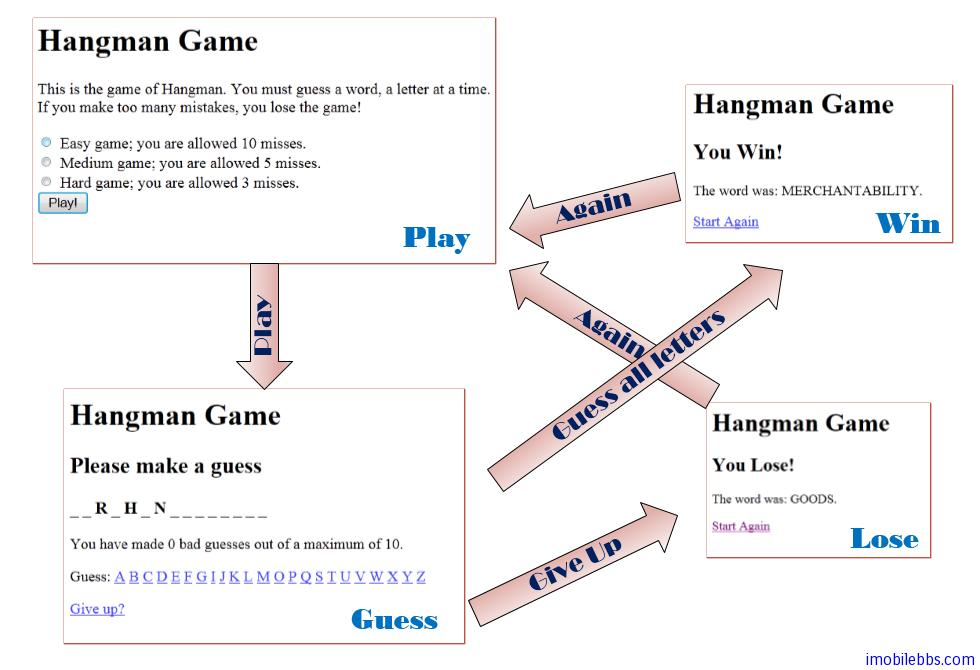
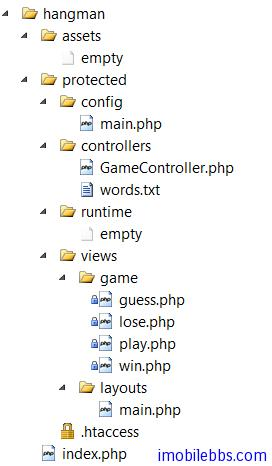

# Yii Framework 开发教程(4) Hangman 猜单词游戏实例

有了前面“Hello，World”的例子和对 Yii Framework Web 应用基础的介绍，可以开始介绍一个简单而相对而有比较完整的Web应用-Hangman（猜单词游戏），这个例子是随 Yii 开发包发布的。通过这个例子可以了解开发 Yii 应用的基本步骤.

说起“Hangman”，让我想起 80 年代末期高中时在 CPC464 计算机上完过的“猜单词游戏”-Hangman，每猜错一次，就把一个小人离绞刑架前进一步。当时 DOS 才刚刚出来：-）。

开发一个 Web 应用，首先是进行需求分析，这个不在本教程之内，但为完整起见，还是把“猜单词游戏”的规则列在下面：

**猜单词游戏**（英文：Hangman，“上吊的人”之意）是一个双人游戏。一位玩家想一个字，另一位尝试猜该玩家所想的字中的每一个字母。

要猜的字以一列横线表示，让玩家知道该字有多少个字母。如果猜字的玩家猜中其中一个字母，另一位便须于该字母出现的所有位置上写上该字母。如果猜的字母没有于该字中出现，另一位玩家便会画吊颈公仔的其中一笔。游戏会在以下情况结束：

“我要 t 字。”“有， 在第八和第十一位。”
   
  - 猜字的玩家猜完所有字母，或猜中整个字
  - 另一位玩家画完整幅图：
  
今天给出的例子就不画出“上吊人”了，猜对了显示“You Win”，猜错了显示“You Lose”。 因此我们可以设计四个页面：



这四个页面对应到 Yii Framework 为 四个 View，可以分别取名为 play, guess, win,lose ，每个页面都显示了“Hangman Game”的标题，因此可以设计一个”MasterPage”，在 Yii 中成为 Layout 布局的模板以供四个 View 共享。Yii 应用采用了 MVC 设计模式，因此我们可以为四个 View 设计一个 Controller–>GameController.

前面的教程说过 Yii 应用使用缺省的目录结构来存放应用的不同部分，可以使用 [Yii提供的工具](http://www.yiiframework.com/doc/guide/1.1/zh_cn/quickstart.first-app)来参加一个缺省的项目目录。不过我个人还是比较喜欢自己创建各个目录，因此根据上面的需求和界面设计，可以创建项目的目录结构如下：



- 创建的 GameController.php 放在 protected/controller 目录下。
- 创建的四个 View guess.php, lose.php, play.php, win.php 放在 protected/views/game 目录下 。目录名  game 对应到所使用到 GameController.
- 创建的共享的 Layout 放在  protected/views/layout 目录下，缺省的布局名称为 main.php
- 应用的配置文件放在 protected/config ,缺省配置文件为 main.php
- 应用的入口脚本为 index.php
- 此外，供猜单词的文本文件为 word.txt

1.首先来看看配置文件 protected/config/main.php

```

    return array(
	    'name'=>'Hangman Game',
	    'defaultController'=>'game',
	    'components'=>array(
		    'urlManager'=>array(
			    'urlFormat'=>'path',
			    'rules'=>array(
				    'game/guess/<g:\w>'=>'game/guess',
			    ),
		    ),

	    ),
    );

```

CWebApplication 应用的所有可写的属性都可以通过配置文件来定义，我们看到配置文件定义了应用的名称为”Hangman Game” ，然后修改 Web 应用缺省的 Controller 名字为 game 对应到 GameController, 如果没有重新定义 defaultController，则缺省的 Controller 名字为 SiteController，这样对于的 View 就要存放到 protected/views/site 目录下。另外这个 Yii 应用打开了 urlManager 组件，这个组件的功能就在后面介绍，主要是用来定义用户可以访问的 URL 的格式（路由格式）。

2.有了这个配置文件，就可以在入口脚本中使用它，每个 Yii 应用的入口脚本 index.php 都是大同小异的,大部分情况下都是 Copy & Paste :-)

```

    $yii=dirname(__FILE__).'/../../framework/yii.php';
    $config=dirname(__FILE__).'/protected/config/main.php';
    require_once($yii);
    Yii::createWebApplication($config)->run();

```

3.然后定义 View 使用的布局文件 protected/views/layout/main.php main.php 为缺省的布局模板，应用可以修改 View 使用的布局，本例就是要缺省的布局名称main.

```

    <!DOCTYPE html PUBLIC "-//W3C//DTD XHTML 1.0 Transitional//EN"
    "http://www.w3.org/TR/xhtml1/DTD/xhtml1-transitional.dtd">
    <html xmlns="http://www.w3.org/1999/xhtml">
    <head>
    <meta http-equiv="Content-Type" content="text/html; charset=utf-8" />
    <title>Hangman Game</title>
    </head>

    <body>
    <h1>Hangman Game</h1>

    <?php echo $content; ?>

    </body>
    </html>

```

布局基本上就是 HTML 文件，其中 作为 view 的 placeholder ，也就是在显示具体的 View 时，比如 play.php 就用 play.php 的内容来替代 $content。从而实现了类似“MasterPage” 的功能。

4.下面就可以逐一定义四个 View，这里就不一一列出了，以 play.php 为例：

```

    <p>This is the game of Hangman.
    You must guess a word, a letter at a time.
    If you make too many mistakes, you lose the game!</p>

    <?php echo CHtml::beginForm(); ?>

    <?php echo CHtml::radioButtonList('level', null, $levels); ?>

    <br/>
    <?php echo CHtml::submitButton('Play!'); ?>

    <?php if($error): ?>
    <span style="color:red">You must choose a difficulty level!</span>
    <?php endif; ?>

    <?php echo CHtml::endForm(); ?>

```

可以看到基本上也是 HTML ,其中 CHtml 为 Yii 框架支持的一个辅助类，用来帮助生成 HTML 代码。 Hangman 比较简单，因此没有使用单独的 Model，而是通过 render 推送的方式传入参数。

需通过传递视图的名称调用 [CController::render()](http://www.yiiframework.com/doc/api/1.1/CController#render-detail)。这个方法将在 protected/views/ControllerID 目录下寻找对应的视图文件.

在视图脚本内部,我们可以通过 $this 来访问控制器实例.我们可以在视图里以 $this->propertyName 的方式 拉取 控制器的任何属性.

我们也可以用以下推送的方式传递数据到视图里:

```

       $this->render('edit', array(
        'var1'=>$value1,
        'var2'=>$value2,
    ));

```

在以上的方式中, [render()](http://www.yiiframework.com/doc/api/1.1/CController#render-detail) 方法将提取数组的第二个参数到变量里.其产生的结果是,在视图脚本里,我们可以直接访问变量 $var1 和 $var2.
 
5.定义好布局和 View 之后，就可以写 GameController 了，

```

        class GameController extends CController
    {
	    /**
	     * @var string sets the default action to be 'play'
	     */
	    public $defaultAction='play';

	    /**
	     * The 'play' action.
	     * In this action, users are asked to choose a difficulty level
	     * of the game.
	     */
	    public function actionPlay()
	    {
		    ...
	    } 

	    /**
	     * The 'guess' action.
	     * This action is invoked each time when the user makes a guess.
	     */
	     public function actionGuess()
	    {
		    ...
	    }

	    /**
	     * The 'guess' action.
	     * This action is invoked when the user gives up the game.
	     */
	    public function actionGiveup()
	    {
		    ...
	    }

	    ...
    }

```
一般情况下 Controller 缺省的 action 为 index ，可以通过$defaultAction 修改缺省的 Action，本例修改为 play. 因此如果本例的 url 为 http://127.0.0.1:8888/yii/demos/hangman/
那么使用 http://127.0.0.1:8888/yii/demos/hangman/index.php 和使用 http://127.0.0.1:8888/yii/demos/hangman/index.php?game/play 的效果是一样的。缺省的 Controller 为 GameController,GameController 缺省的 action 为 play.

Action (动作），动作可以被定义为一个以 action 单词作为前缀命名的方法。Hangman 定义了三个 action ,actionPlay ,actionGuess, actionGiveup ,GameController 其它方法和属性和生成单词，判断是否猜对等为具体的游戏逻辑和 Yii 框架关系不大，就不介绍了。

6.首先看看缺省的 playAction ，这是用户调用的缺省方法，也就是说当用户组地址栏输入 http://127.0.0.1:8888/yii/demos/hangman/index.php （或http://127.0.0.1:8888/yii/demos/hangman/index.php?game/play）所调用的 Action。

```

    public function actionPlay()
    {
    	static $levels=array(
    		'10'=>'Easy game; you are allowed 10 misses.',
    		'5'=>'Medium game; you are allowed 5 misses.',
    		'3'=>'Hard game; you are allowed 3 misses.',
    	);
    
    	// if a difficulty level is correctly chosen
    	if(isset($_POST['level'])
    	   && isset($levels[$_POST['level']]))
    	{
    		$this->word=$this->generateWord();
    		$this->guessWord=str_repeat('_',strlen($this->word));
    		$this->level=$_POST['level'];
    		$this->misses=0;
    		$this->setPageState('guessed',null);
    		// show the guess page
    		$this->render('guess');
    	}
    	else
    	{
    		$params=array(
    			'levels'=>$levels,
    			// if this is a POST request,
    			//it means the level is not chosen
    			'error'=>Yii::app()->request->isPostRequest,
    		);
    		// show the difficulty level page
    		$this->render('play',$params);
    	}
    }
```

这个方法定义了游戏的三个难度等级$levels, 有两个分支，如果没有选择难易等级，则调用$this->render(‘play’,$params)，显示 Play 页面，就$params （Array）推送到对应的 View ,protected/views/play.php，参考上面 View 的定义：

```


    <?php echo CHtml::radioButtonList('level', null, $levels); ?>

```

View 使用 Radiobutton来显示 $levels 定义的列表。

如果用户选择了难易等级，在把 Level,单词等存放到 GameController 所定义的属性中，如 word，level 等。GameController 拍手与 CController 也是 CComponent 的子类，CComponent 支持了类似 C#，Java 的属性功能。具体后面再介绍。
然后调用$this->render(‘guess’); 显示 Guess 页面。


Guess 页面 guess.php 定义如下：

```

    <h2>Please make a guess</h2>
    
    <h3 style="letter-spacing: 4px;">
      <?php echo $this->guessWord; ?></h3>
    
    <p>You have made
      <?php echo $this->misses; ?>
      bad guesses out of a maximum of
      <?php echo $this->level; ?>.</p>
    
    <?php echo CHtml::statefulForm(); ?>
    
    <p>Guess:
    <?php
    for($i=ord('A');$i<=ord('Z');++$i)
    {
    	if(!$this->isGuessed(chr($i)))
    		echo "\n".CHtml::linkButton(chr($i),
    		array('submit'=>array('guess','g'=>chr($i))));
    }
    ?>
    </p>
    
    <p><?php echo CHtml::linkButton('Give up?',
    array('submit'=>array('giveup'))); ?></p>
    
    </form>

```

在 View 中可以直接通过 $this 来访问对应的 Controller 实例对象的方法和属性。 如 $this->guessWord，$this->isGuessed(chr($i))等。
其中点击 26 个字母触发 guessAction (array(‘submit’=>array(‘guess’,’g’=>chr($i))))).

7.下面为 guessAction 的定义
 
```

    public function actionGuess()
    {
    	// check to see if the letter is guessed correctly
    	if(isset($_GET['g'][0]) && ($result=$this->guess($_GET['g'][0]))!==null)
    		$this->render($result ? 'win' : 'lose');
    	else // the letter is guessed correctly, but not win yet
    	{
    		$guessed=$this->getPageState('guessed',array());
    		$guessed[$_GET['g'][0]]=true;
    		$this->setPageState('guessed',$guessed,array());
    		$this->render('guess');
    	}
    }

```


其中参数 ‘g’由 guess 页面提交是传入， 如果单词全部猜对在显示”You win” 或用完所有次数猜错显示“You lose” , $this->render($result ? ‘win’ : ‘lose’),
如果还有机会猜还是回到 guess 页面 $this->render(‘guess’);

8.在 Guess 页面上还有一个“Give up” 按钮，用户点击则触发 giveupAction.这个方法比较简单，直接显示 lose 页面

```

    public function actionGiveup()
    {
    	$this->render('lose');
    }
    

```

至此 Hangman 游戏基本就完成了。游戏虽然简单，但说明了使用 Yii 开发应用的基本流程，下面给出 Yii 开发文档给出的开发流程，Hangman 比较简单，没有用到数据库和国际化等。

此处的开发流程假设我们已经完成了对应用的需求分析和必要的设计分析。

1. 创建目录结构骨架。[创建第一个 Web 应用](http://www.yiiframework.com/doc/guide/1.1/zh_cn/quickstart.first-app) 中讲到的 yiic 工具可以快速实现此步骤。
2. 配置此[应用](http://www.yiiframework.com/doc/guide/1.1/zh_cn/basics.application)。这是通过修改应用配置文件实现的。 此步骤可能也需要编写一些应用组件（例如用户组件）。
3. 为所管理的每个类型的数据创建一个 [模型](http://www.yiiframework.com/doc/guide/1.1/zh_cn/basics.model) 类。 [Creating First Yii Application](http://www.yiiframework.com/doc/guide/1.1/zh_cn/doc/guide/quickstart.first-app#implementing-crud-operations) 和 [Automatic Code Generation](http://www.yiiframework.com/doc/guide/1.1/zh_cn/doc/guide/topics.gii) 讲述的 Gii 工具可以用于快速为每个数据表创建 [active record](http://www.yiiframework.com/doc/guide/1.1/zh_cn/database.ar) 类。
4. 为每个类型的用户请求 创建一个 [控制器](http://www.yiiframework.com/doc/guide/1.1/zh_cn/basics.controller) 类。 具体如何对用户请求归类要看实际需求。总体来说，如果一个模型类需要被用户访问，他就应该有一个相应的控制器类。 Gii 工具也可以自动实现这一步骤。
5. 实现 [动作](http://www.yiiframework.com/doc/guide/1.1/zh_cn/basics.controller#action) 和他们相应的 [视图](http://www.yiiframework.com/doc/guide/1.1/zh_cn/basics.view)。 这是真正所需要做的工作。
6.  在控制器类中配置必要的动作 [过滤器](http://www.yiiframework.com/doc/guide/1.1/zh_cn/basics.controller#filter)。
7. 如果需要主题功能，创建 [主题](http://www.yiiframework.com/doc/guide/1.1/zh_cn/topics.theming) 。
8.  如果需要 [国际化（I18N）](http://www.yiiframework.com/doc/guide/1.1/zh_cn/topics.i18n) ，创建翻译信息。
9.  对可缓存的数据点和视图点应用适当的 [缓存](http://www.yiiframework.com/doc/guide/1.1/zh_cn/caching.overview) 技术。
10.  最终 [调整](http://www.yiiframework.com/doc/guide/1.1/zh_cn/topics.performance) 与部署。

Tags: [PHP](http://www.imobilebbs.com/wordpress/archives/tag/php), [Yii](http://www.imobilebbs.com/wordpress/archives/tag/yii)
    
    
    
    
    