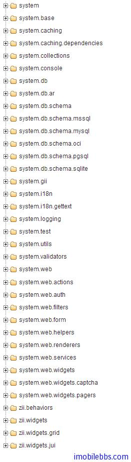

# Yii Framework 开发教程(2) Yii Web 应用基础

有了前面的“Hello,World”， Yii 应用开发似乎很容易，别这么快下结论：-），想起多年以前刚开始使用 MFC 开发时，写完第一个 Hello，World 之后，还是觉得无从下手，不知道怎么开始写 MFC 应用，这是因为 MFC 提供了大量的类库，如果对 MFC 应用程序框架和其提供的主要类库不事先了解的话，基本上就没办法写应用，学习 Yii Framework，也要先了解一下组成 Yii 应用的几个主要组成部分也一些常用的类。

在前面教程说过 Yii 采用 MVC（模型-视图-控制器），并介绍了入口脚本和主应用程序类 CWebApplication 类。应用类的实例由 [入口脚本](http://www.yiiframework.com/doc/guide/1.1/zh_cn/basics.entry) 创建为一个对象（Singleton)。这个应用单例对象可以在任何地方通过 [Yii::app()](http://www.yiiframework.com/doc/api/1.1/YiiBase#app-detail) 访问。

## 主应用实例（CWebApplication）

默认情况下，应用是一个 [CWebApplication](http://www.yiiframework.com/doc/api/1.1/CWebApplication) 的实例。要自定义它，我们通常需要提供一个配置文件 （或数组） 以创建应用实例时初始化其属性值。自定义应用的另一种方式是继承 [CWebApplication](http://www.yiiframework.com/doc/api/1.1/CWebApplication)。

配置是一个键值对数组。每个键代表应用实例中某属性的名字，每个值即相应属性的初始值。 例如，如下的配置设定了应用的 [name](http://www.yiiframework.com/doc/api/1.1/CApplication#name-detail) 和 [defaultController](http://www.yiiframework.com/doc/api/1.1/CWebApplication#defaultController-detail) 属性。

```


    array(
      'name'=>'Yii Framework',
      'defaultController'=>'site',
    )

```

我们通常在一个单独的 PHP 脚本（e.g.protected/config/main.php）中保存这些配置。在脚本中， 我们通过以下方式返回此配置数组：

```


    return array(...);
```

要应用此配置，我们将配置文件的名字作为参数传递给应用的构造器，或像下面这样传递到 [Yii::createWebApplication()](http://www.yiiframework.com/doc/api/1.1/Yii#createWebApplication) 。这通常在 [入口脚本](http://www.yiiframework.com/doc/guide/1.1/zh_cn/basics.entry) 中完成：
```


    $app=Yii::createWebApplication($configFile);

```

## 应用组件

应用的功能可以通过其灵活的组件结构轻易地自定义或增强。应用管理了一系列应用组件，每个组件实现一特定功能。 例如，应用通过 [CUrlManager](http://www.yiiframework.com/doc/api/1.1/CUrlManager) 和 [CHttpRequest](http://www.yiiframework.com/doc/api/1.1/CHttpRequest) 的帮助解析来自用户的请求。

通过配置应用的 [components](http://www.yiiframework.com/doc/api/1.1/CApplication#components) 属性， 我们可以自定义应用中用到的任何组件类及其属性值。例如，我们可以配置应用的 [CMemCache](http://www.yiiframework.com/doc/api/1.1/CMemCache) 组件， 这样它就可以使用多个 memcache 服务器实现缓存：

```

    array(
      ......
      'components'=>array(
          ......
          'cache'=>array(
              'class'=>'CMemCache',
              'servers'=>array(
                  array('host'=>'server1', 'port'=>11211, 'weight'=>60),
                  array('host'=>'server2', 'port'=>11211, 'weight'=>40),
              ),
          ),
      ),
    )

```

如上所示，我们在 components 数组中添加了 cache 元素。cache 元素表明此组件的类是 CMemCache, 他的 servers 属性应依此初始化。

要访问一个应用组件，使用 Yii::app()->ComponentID ，其中的 ComponentID 是指组件的 ID（例如 Yii::app()->cache）。

应用的组件可以通过在其配置中设置 enabled 为 false 禁用。当我们访问被禁用的组件时将返回 Null。

## CWebApplication的的生命周期

当处理用户请求时，应用将经历如下声明周期：

1. 通过 [CApplication::preinit()](http://www.yiiframework.com/doc/api/1.1/CApplication#preinit) 预初始化应用；
2. 设置类的自动装载器和错误处理；
3. 注册核心类组件；
4. 加载应用配置；
5. 通过 [CApplication::init()](http://www.yiiframework.com/doc/api/1.1/CApplication#init) 初始化应用:
     - 注册应用行为；
     - 载入静态应用组件；
6. 触发 [onBeginRequest](http://www.yiiframework.com/doc/api/1.1/CApplication#onBeginRequest) 事件；
7. 处理用户请求:
     - 解析用户请求；
     - 创建控制器；
     - 运行控制器；
8.触发 [onEndRequest](http://www.yiiframework.com/doc/api/1.1/CApplication#onEndRequest) 事件。

## CController控制类

控制器 是 [CController](http://www.yiiframework.com/doc/api/1.1/CController) 或其子类的实例。它在当用户请求时由应用创建。 当一个控制器运行时，它执行所请求的动作，动作通常会引入所必要的模型并渲染相应的视图。 动作的最简形式，就是一个名字以 action 开头的控制器类方法。

控制器通常有一个默认的动作。当用户的请求未指定要执行的动作时，默认动作将被执行。 默认情况下，默认的动作名为 index。它可以通过设置 [CController::defaultAction](http://www.yiiframework.com/doc/api/1.1/CController#defaultAction) 修改。

如下是一个控制器类所需的最简代码。由于此控制器未定义任何动作，对它的请求将抛出一个异常。

```

        class SiteController extends CController
    {
    }

```

## 路由

用户访问网页的 URL 的基本格式为 /index.php?r=XController/YAction , 对应到代码为  protected 目录下 controllers 子目录下的 XController.php 中定义的的类 XController 的 YAction 方法。 例如，路由 post/edit 代表 PostController 及其 edit 动作。默认情况下，URL http://hostname/index.php?r=post/edit 即请求此控制器和动作。 **模型（CModel类）** 模型是 [CModel](http://www.yiiframework.com/doc/api/1.1/CModel) 或其子类的实例。模型用于保持数据以及与其相关的业务逻辑.

Yii 实现了两种类型的模型：表单模型和 Active Record。二者均继承于相同的基类 [CModel](http://www.yiiframework.com/doc/api/1.1/CModel)。

表单模型是 [CFormModel](http://www.yiiframework.com/doc/api/1.1/CFormModel) 的实例。表单模型用于保持从用户的输入获取的数据。 这些数据经常被获取，使用，然后丢弃。例如，在一个登录页面中， 我们可以使用表单模型用于表示由最终用户提供的用户名和密码信息。更多详情，请参考 [使用表单](http://www.yiiframework.com/doc/guide/1.1/zh_cn/form.model)。

Active Record (AR) 是一种用于通过面向对象的风格抽象化数据库访问的设计模式。 每个 AR 对象是一个 [CActiveRecord](http://www.yiiframework.com/doc/api/1.1/CActiveRecord) 或其子类的实例。代表数据表中的一行。 行中的字段对应 AR 对象中的属性。

## 视图View

视图是一个包含了主要的用户交互元素的 PHP 脚本.他可以包含 PHP 语句,但是我们建议这些语句不要去改变数据模型,且最好能够保持其单纯性(单纯作为视图)。为了实现逻辑和界面分离,大段的逻辑应该被放置于控制器或模型中,而不是视图中。

和 Windows 应用类比的话，View 类似于 Windows 应用的 Form 类，其中使用可以控件来定义 UI，控件对应到 Yii 框架成为 CWidget，它是一个主要用于表现数据的组件.小物件通常内嵌于一个视图来产生一些复杂而独立的用户界面.例如,一个日历小物件可用于渲染一个复杂的日历界面.小物件使用户界面更加可复用.

和 Asp.Net 类似的 Masterpage，Yii 中称为 Layout（布局）。

布局是一种用来修饰视图的特殊的视图文件.它通常包含了用户界面中通用的一部分视图.例如:布局可以包含 header 和 footer 的部分,然后把内容嵌入其间.

```

    ......header here......
    <?php echo $content; ?>
    ......footer here......
```


其中的 $content 则储存了内容视图的渲染结果.

当使用 [render()](http://www.yiiframework.com/doc/api/1.1/CController#render-detail) 时,布局被隐式应用.视图脚本 protected/views/layouts/main.php 是默认的布局文件.这可以通过改变 [CWebApplication::layout](http://www.yiiframework.com/doc/api/1.1/CWebApplication#layout-detail) 或者 [CWebApplication::layout](http://www.yiiframework.com/doc/api/1.1/CWebApplication#layout-detail) 进行自定义。要渲染一个不带布局的视图，则需调用 [renderPartial()](http://www.yiiframework.com/doc/api/1.1/CController#renderPartial-detail) 。

以上介绍了 Yii 应用的几个重要的组成部分，可以参考“Hello,World”示例，并且 Yii 应用的文件结构也有缺省的定义，下面为应用的缺省目录结构：

    index.php				Web 应用入口脚本文件
    index-test.php		    功能测试使用的入口脚本文件
    assets/				    包含公开的资源文件
    css/				    包含 CSS 文件
    images/				    包含图片文件
    themes/				    包含应用主题
    protected/				包含受保护的应用文件
    yiic			        yiic 命令行脚本
    yiic.bat			    Windows 下的 yiic 命令行脚本
    yiic.php			    yiic 命令行 PHP 脚本
    commands/			    包含自定义的 ‘yiic’ 命令
    shell/		            包含自定义的 ‘yiic shell’ 命令
    components/			    包含可重用的用户组件
    Controller.php		    所有控制器类的基础类
    Identity.php		    用来认证的 ‘Identity’ 类
    config/			        包含配置文件
    console.php		        控制台应用配置
    main.php		        Web 应用配置
    test.php		        功能测试使用的配置
    controllers/			包含控制器的类文件
    SiteController.php		默认控制器的类文件
    data/			        包含示例数据库
    schema.mysql.sql		示例 MySQL 数据库
    schema.sqlite.sql	 	示例 SQLite 数据库
    testdrive.db		    示例 SQLite 数据库文件
    extensions/			    包含第三方扩展
    messages/			    包含翻译过的消息
    models/			        包含模型的类文件
    LoginForm.php		   ‘login’ 动作的表单模型
    ContactForm.php		   ‘contact’ 动作的表单模型
    runtime/			   包含临时生成的文件
    tests/			       包含测试脚本
    views/			       包含控制器的视图和布局文件
    layouts/		       包含布局视图文件
    main.php	           所有视图的默认布局
    column1.php	           用单列页面使用的布局
    column2.php	           使用双列的页面使用的布局
    site/		           包含 ‘site’ 控制器的视图文件
    pages/	               包含 “静态” 页面
    about.php	           “about” 页面的视图
    contact.php	           ‘contact’ 动作的视图
    error.php	           ‘error’ 动作的视图(显示外部错误)
    index.php	           ‘index’ 动作的视图
    login.php	           ‘login’ 动作的视图
    system/		           包含系统视图文件
 
在正式开发 Yii 应用前，先粗略看一下 Yii 提供的类库 http://www.yiiframework.com/doc/api/ ，
下图列出来 Yii Framework 提供的类库的包定义：



只有先了解 Yii 应用的主要组成部分和每个类包支持的主要功能，才能后续比较灵活的使用 Yii 来开发 Web 应用。

Tags: [PHP](http://www.imobilebbs.com/wordpress/archives/tag/php), [Yii](http://www.imobilebbs.com/wordpress/archives/tag/yii)
